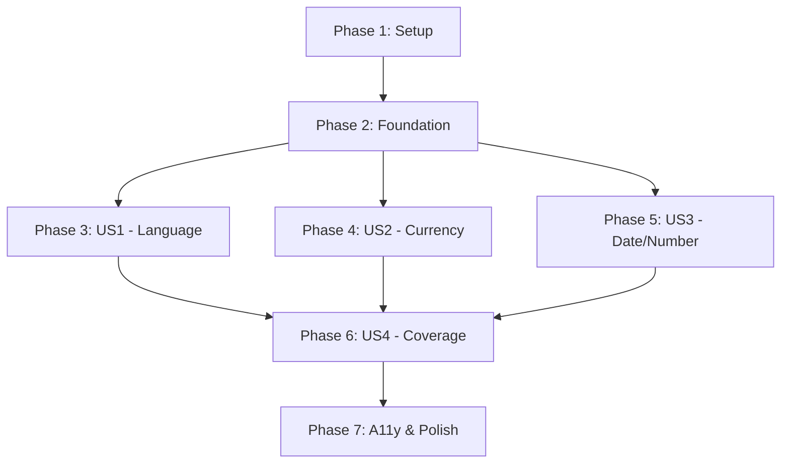

# Tasks: Internationalization (i18n) Support

**Input**: Design documents from `/specs/002-i18n/`
**Prerequisites**: plan.md, spec.md, research.md, data-model.md, contracts/, quickstart.md

**Tests**: Per Constitution Principle III (Type Safety & Test-First), tests are REQUIRED for this feature. Tests cover translation fallback, currency/date formatting, missing translations, and component rendering in each language.

**Organization**: Tasks are grouped by user story to enable independent implementation and testing of each story.

## Format: `[ID] [P?] [Story] Description`

- **[P]**: Can run in parallel (different files, no dependencies)
- **[Story]**: Which user story this task belongs to (US1, US2, US3, US4)
- Include exact file paths in descriptions

## Path Conventions

- **Single project**: `src/`, `tests/` at repository root
- Paths shown below use absolute file paths from repository root

---

## Phase 1: Setup (Shared Infrastructure)

**Purpose**: Project initialization and i18n infrastructure setup

- [X] T001 Create `src/i18n/` directory for i18n infrastructure
- [X] T002 Create `src/locales/` directory for translation files
- [X] T003 Create `tests/i18n/` directory for i18n unit tests
- [X] T004 [P] Create `tests/integration/` directory for integration tests

---

## Phase 2: Foundational (Blocking Prerequisites)

**Purpose**: Core i18n infrastructure that MUST be complete before ANY user story can be implemented

**⚠️ CRITICAL**: No user story work can begin until this phase is complete

- [X] T005 Add `LocaleCode` and `CurrencyCode` types to `src/types.ts`
- [X] T006 Add `LOCALE` and `CURRENCY` constants to `src/constants.ts`
- [X] T007 [P] Create `src/i18n/types.ts` with `TranslationBundle`, `TranslationKey`, and function types
- [X] T008 [P] Create `src/i18n/utils.ts` with `translate()`, `formatPrice()`, `formatDate()`, `formatNumber()` functions
- [X] T009 Create `src/i18n/context.tsx` with `I18nProvider` and `I18nContext`
- [X] T010 [P] Create `src/i18n/hooks.ts` with `useI18n()`, `useTranslation()`, `useFormatters()` hooks
- [X] T011 Create `src/i18n/index.ts` barrel export file
- [X] T012 Wrap app in `I18nProvider` in `src/main.tsx`

**Checkpoint**: Foundation ready - user story implementation can now begin in parallel

---

## Phase 3: User Story 1 - Language Selection (Priority: P1) 🎯 MVP

**Goal**: Enable multi-language UI text display with English as source language and Spanish, French, German translations

**Independent Test**: Change LOCALE constant and verify all UI text renders in the selected language. Test with all 4 languages (en-US, es-ES, fr-FR, de-DE) and verify fallback to English for unsupported locales.

### Tests for User Story 1 (REQUIRED - Constitution Principle III) ⚠️

> **NOTE: Write these tests FIRST, ensure they FAIL before implementation**

- [X] T013 [P] [US1] Unit test for `translate()` function in `tests/i18n/utils.test.ts`
- [X] T014 [P] [US1] Unit test for translation fallback behavior in `tests/i18n/utils.test.ts`
- [X] T015 [P] [US1] Unit test for invalid locale handling in `tests/i18n/utils.test.ts`
- [X] T016 [P] [US1] Unit test for `useTranslation()` hook in `tests/i18n/hooks.test.tsx`
- [X] T017 [P] [US1] Integration test for component translation in `tests/integration/i18n-components.test.tsx`

### Implementation for User Story 1

- [X] T018 [P] [US1] Create English translation file `src/locales/en.ts` with complete translation bundle
- [X] T019 [P] [US1] Create Spanish translation file `src/locales/es.ts` matching English structure
- [X] T020 [P] [US1] Create French translation file `src/locales/fr.ts` matching English structure
- [X] T021 [P] [US1] Create German translation file `src/locales/de.ts` matching English structure
- [X] T022 [US1] Refactor `FilterSort` component in `src/components/FilterSort.tsx` to use `useTranslation()` hook
- [X] T023 [US1] Refactor `ItemCard` component in `src/components/ItemCard.tsx` to use `useTranslation()` hook
- [X] T024 [US1] Refactor `ItemGrid` component in `src/components/ItemGrid.tsx` to use `useTranslation()` hook
- [X] T025 [US1] Refactor `InactiveNotice` component in `src/components/InactiveNotice.tsx` to use `useTranslation()` hook
- [X] T026 [US1] Verify all UI text is translatable (no hardcoded strings remain)

**Checkpoint**: At this point, User Story 1 should be fully functional - all UI displays in configured language with fallback to English

---

## Phase 4: User Story 2 - Currency Formatting (Priority: P1) 🎯 MVP

**Goal**: Format all prices according to configured currency with correct symbols, decimals, and locale conventions

**Independent Test**: Change CURRENCY constant and verify all prices format correctly. Test with USD, EUR, GBP, JPY and verify correct symbol placement, decimal handling, and thousands separators.

### Tests for User Story 2 (REQUIRED - Constitution Principle III) ⚠️

> **NOTE: Write these tests FIRST, ensure they FAIL before implementation**

- [X] T027 [P] [US2] Unit test for `formatPrice()` with USD in `tests/i18n/utils.test.ts`
- [X] T028 [P] [US2] Unit test for `formatPrice()` with EUR in `tests/i18n/utils.test.ts`
- [X] T029 [P] [US2] Unit test for `formatPrice()` with GBP in `tests/i18n/utils.test.ts`
- [X] T030 [P] [US2] Unit test for `formatPrice()` with JPY (0 decimals) in `tests/i18n/utils.test.ts`
- [X] T031 [P] [US2] Unit test for `formatPrice()` error handling in `tests/i18n/utils.test.ts`
- [X] T032 [P] [US2] Integration test for price display in multiple currencies in `tests/integration/i18n-components.test.tsx`

### Implementation for User Story 2

- [X] T033 [US2] Refactor `ItemCard` component to use `formatPrice()` for price display in `src/components/ItemCard.tsx`
- [X] T034 [US2] Refactor `ItemDetail` component to use `formatPrice()` for price display in `src/components/ItemDetail.tsx`
- [X] T035 [US2] Verify all price displays use `formatPrice()` consistently across all components
- [X] T036 [US2] Test price formatting with all 4 currencies manually (USD, EUR, GBP, JPY)

**Checkpoint**: At this point, User Story 2 should be fully functional - all prices display in configured currency format

---

## Phase 5: User Story 3 - Date and Number Formatting (Priority: P2)

**Goal**: Format dates and numbers according to locale conventions (date order, separators, decimal format)

**Independent Test**: Change LOCALE constant and verify dates/numbers follow locale conventions. Test with en-US, en-GB, de-DE, fr-FR and verify correct formatting.

### Tests for User Story 3 (REQUIRED - Constitution Principle III) ⚠️

> **NOTE: Write these tests FIRST, ensure they FAIL before implementation**

- [X] T037 [P] [US3] Unit test for `formatDate()` with en-US locale in `tests/i18n/utils.test.ts`
- [X] T038 [P] [US3] Unit test for `formatDate()` with en-GB locale in `tests/i18n/utils.test.ts`
- [X] T039 [P] [US3] Unit test for `formatDate()` with de-DE locale in `tests/i18n/utils.test.ts`
- [X] T040 [P] [US3] Unit test for `formatDate()` with fr-FR locale in `tests/i18n/utils.test.ts`
- [X] T041 [P] [US3] Unit test for `formatDate()` error handling in `tests/i18n/utils.test.ts`
- [X] T042 [P] [US3] Unit test for `formatNumber()` with different locales in `tests/i18n/utils.test.ts`

### Implementation for User Story 3

- [X] T043 [US3] Refactor `InactiveNotice` component to use `formatDate()` for sale window dates in `src/components/InactiveNotice.tsx`
- [X] T044 [US3] Verify all date displays use `formatDate()` consistently across all components
- [X] T045 [US3] Test date formatting with all 4 locales manually (en-US, en-GB, de-DE, fr-FR)

**Checkpoint**: At this point, User Story 3 should be fully functional - all dates/numbers display in locale-specific format

---

## Phase 6: User Story 4 - Translation Coverage (Priority: P3)

**Goal**: Ensure all user-facing text elements are translatable including conditions, delivery options, filters, sort options, buttons, and messages

**Independent Test**: Audit all components for hardcoded strings. Configure each language and verify no English text appears (except in descriptions/data).

### Tests for User Story 4 (REQUIRED - Constitution Principle III) ⚠️

> **NOTE: Write these tests FIRST, ensure they FAIL before implementation**

- [X] T046 [P] [US4] Unit test for translation key completeness in `tests/i18n/translations.test.ts`
- [X] T047 [P] [US4] Integration test for ItemDetail modal in multiple languages in `tests/integration/i18n-components.test.tsx`
- [X] T048 [P] [US4] Integration test for FilterSort in multiple languages in `tests/integration/i18n-components.test.tsx`

### Implementation for User Story 4

- [X] T049 [US4] Refactor `ItemDetail` component to use translations for all labels/buttons in `src/components/ItemDetail.tsx`
- [X] T050 [US4] Refactor `ImageCarousel` component to use translations for alt text in `src/components/ImageCarousel.tsx`
- [X] T051 [US4] Add translation keys for all item conditions to translation files
- [X] T052 [US4] Add translation keys for all delivery options to translation files
- [X] T053 [US4] Audit all components and verify no hardcoded strings remain
- [X] T054 [US4] Update translation files with any missing keys identified during audit

**Checkpoint**: At this point, User Story 4 should be fully functional - complete translation coverage achieved

---

## Phase 7: Accessibility & Cross-Cutting Concerns

**Purpose**: Ensure accessibility compliance (Constitution Principle IV) and polish

- [X] T055 [P] Create accessibility test for FilterSort in English in `tests/a11y/i18n.a11y.test.tsx`
- [X] T056 [P] Create accessibility test for FilterSort in Spanish in `tests/a11y/i18n.a11y.test.tsx`
- [X] T057 [P] Create accessibility test for FilterSort in French in `tests/a11y/i18n.a11y.test.tsx`
- [X] T058 [P] Create accessibility test for FilterSort in German in `tests/a11y/i18n.a11y.test.tsx`
- [X] T059 [P] Create accessibility test for ItemDetail in English in `tests/a11y/i18n.a11y.test.tsx`
- [X] T060 [P] Create accessibility test for ItemDetail in Spanish in `tests/a11y/i18n.a11y.test.tsx`
- [X] T061 [P] Create accessibility test for InactiveNotice in multiple languages in `tests/a11y/i18n.a11y.test.tsx`
- [X] T062 Verify ARIA labels are translatable and present in all languages
- [X] T063 Test keyboard navigation in all languages
- [X] T064 Run full test suite: `npm test`
- [X] T065 Verify build succeeds with no TypeScript errors: `npm run build`
- [X] T066 Update README.md with i18n usage instructions and supported locales
- [X] T067 Add development logging for missing translations (development mode only)
- [X] T068 Verify production build has no console warnings for translations

---

## Dependencies & Execution Strategy

### Story Completion Order



### Dependency Notes

- **Phase 1 & 2 are BLOCKING**: Must complete before any user story work
- **US1, US2, US3 are INDEPENDENT**: Can be implemented in parallel after Phase 2
- **US4 depends on US1-US3**: Requires core infrastructure from all three P1/P2 stories
- **Phase 7 (Accessibility)**: Should run after US4 but tests can be written in parallel

### Parallel Execution Examples

**Phase 2 (Foundation) - Parallel Opportunities**:
```bash
# These tasks can run in parallel (different files):
T007 (types.ts) || T008 (utils.ts) || T010 (hooks.ts)
```

**Phase 3 (US1) - Parallel Opportunities**:
```bash
# Tests can be written in parallel:
T013 || T014 || T015 || T016 || T017

# Translation files can be created in parallel:
T018 || T019 || T020 || T021

# Component refactoring can be parallelized:
T022 (FilterSort) || T023 (ItemCard) || T024 (ItemGrid) || T025 (InactiveNotice)
```

**Phase 4 (US2) - Parallel Opportunities**:
```bash
# All currency format tests can run in parallel:
T027 (USD) || T028 (EUR) || T029 (GBP) || T030 (JPY) || T031 (errors)

# Component refactoring can be parallelized:
T033 (ItemCard) || T034 (ItemDetail)
```

**Phase 5 (US3) - Parallel Opportunities**:
```bash
# All date format tests can run in parallel:
T037 (en-US) || T038 (en-GB) || T039 (de-DE) || T040 (fr-FR) || T041 (errors) || T042 (numbers)
```

**Phase 7 (A11y) - Parallel Opportunities**:
```bash
# All a11y tests can be written in parallel:
T055 || T056 || T057 || T058 || T059 || T060 || T061
```

---

## Implementation Strategy

### MVP Scope (Recommended First Delivery)

**Minimum Viable Product includes**:
- Phase 1: Setup (T001-T004)
- Phase 2: Foundation (T005-T012)
- Phase 3: User Story 1 - Language Selection (T013-T026)
- Phase 4: User Story 2 - Currency Formatting (T027-T036)

**Rationale**: US1 + US2 are both Priority P1 and deliver immediate value (multi-language + correct pricing). This is the smallest independently deployable increment.

**After MVP, deliver incrementally**:
1. **Second increment**: Phase 5 (US3 - Date/Number Formatting)
2. **Third increment**: Phase 6 (US4 - Translation Coverage)
3. **Final increment**: Phase 7 (Accessibility & Polish)

### Test-First Approach (Constitution Principle III)

For each user story phase:
1. Write tests FIRST (TDD approach)
2. Verify tests FAIL
3. Implement functionality
4. Verify tests PASS
5. Refactor if needed
6. Run full test suite

### Type Safety Validation

After each phase:
- Run `npm run build` to verify TypeScript compilation
- Check for any type errors in translation keys
- Verify autocomplete works for `t()` function calls

### Performance Validation

After Phase 4 (US2 complete):
- Measure bundle size: Should be <200KB total
- Test translation lookup performance: <10ms per call
- Verify only active language is bundled (tree-shaking working)

---

## Task Summary

**Total Tasks**: 68
- Phase 1 (Setup): 4 tasks
- Phase 2 (Foundation): 8 tasks
- Phase 3 (US1 - Language): 14 tasks (5 tests + 9 implementation)
- Phase 4 (US2 - Currency): 10 tasks (6 tests + 4 implementation)
- Phase 5 (US3 - Date/Number): 9 tasks (6 tests + 3 implementation)
- Phase 6 (US4 - Coverage): 9 tasks (3 tests + 6 implementation)
- Phase 7 (A11y & Polish): 14 tasks

**Parallel Opportunities**: 38 tasks marked with [P] can run in parallel

**Testing Coverage**:
- Unit tests: 20 tasks
- Integration tests: 3 tasks
- Accessibility tests: 7 tasks
- **Total test tasks**: 30 (44% of all tasks - strong test coverage per Constitution)

**Independent Test Criteria**:
- **US1**: Change LOCALE, verify UI in that language
- **US2**: Change CURRENCY, verify prices format correctly
- **US3**: Change LOCALE, verify dates/numbers format correctly
- **US4**: Audit components, verify no hardcoded strings

**Format Validation**: ✅ All tasks follow required checklist format with checkbox, ID, optional [P] and [Story] labels, and file paths

---

## Next Steps

1. **Review this task list** with the team
2. **Start with MVP scope** (Phases 1-4: Setup + Foundation + US1 + US2)
3. **Follow test-first approach** (write tests before implementation)
4. **Track progress** using GitHub Issues or project board
5. **Deploy incrementally** after each user story is complete and tested

**Ready to begin implementation!** 🚀
