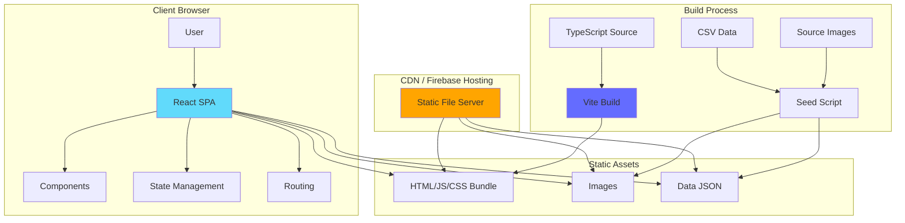
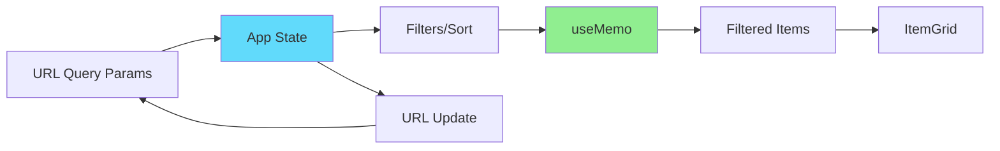
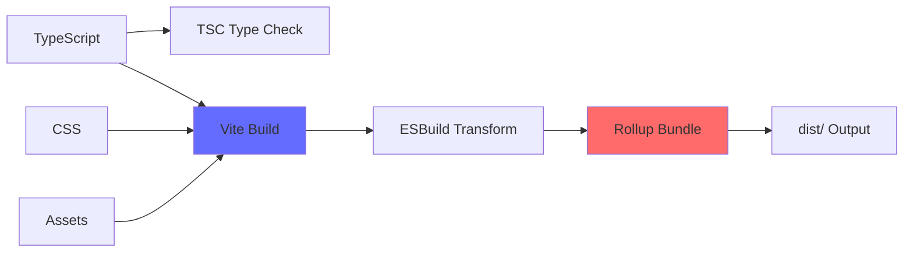
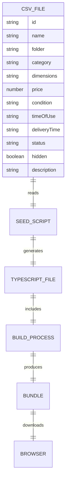
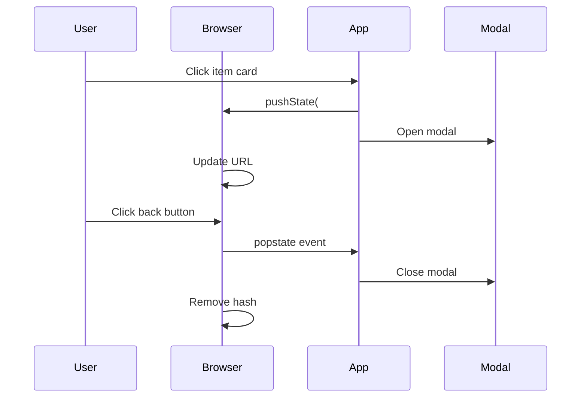
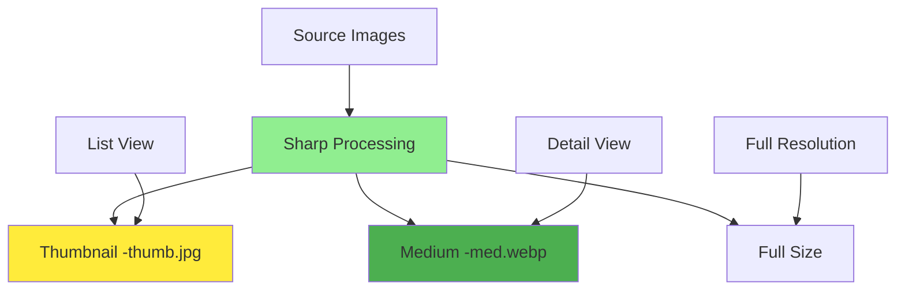

# Architecture Overview

This document provides a comprehensive overview of the Garage Sale application's architecture, technology stack, and design decisions.

## System Architecture

The Garage Sale application follows a **Static Single-Page Application (SPA)** architecture pattern with no backend server.



## Architecture Patterns

### 1. Static JAMstack Architecture

**JAMstack** = JavaScript + APIs + Markup

- **JavaScript**: React handles all dynamic functionality
- **APIs**: No external APIs (all data is static/hardcoded)
- **Markup**: Pre-rendered at build time by Vite

**Benefits:**
- 🚀 Fast performance (no server-side processing)
- 💰 Cost-effective (static hosting is cheap/free)
- 🔒 Secure (no backend to attack)
- 📈 Scalable (CDN handles all traffic)

### 2. Component-Based Architecture

React components are organized hierarchically:

```
App (Root)
├── Header
├── FilterSort
├── ItemGrid
│   ├── ItemCard (repeated)
│   └── ItemDetail (modal)
│       └── ImageCarousel
└── InactiveNotice
```

See [Component Diagram](./Component-Diagram.md) for detailed component relationships.

### 3. State Management Pattern

**Local State with Hooks** - No Redux or external state management:

- `useState` for component-local state
- `useMemo` for computed values (filtering, sorting)
- `useEffect` for side effects (URL sync, modal management)
- URL query parameters for shareable filter state

**State Flow:**



### 4. Temporal Activation Pattern

The application uses a **time-based gating pattern**:

```typescript
const now = new Date();
const isSaleActive = now >= SALE_START && now <= SALE_END;

if (!isSaleActive) {
  return <InactiveNotice />;
}
return <MainApp />;
```

**Benefits:**
- No need to manually enable/disable the site
- Automatic activation within configured window
- Clear start/end dates displayed to visitors

## Technology Stack

### Frontend Framework

#### React 18.2
- **Functional components** with hooks (no class components)
- **Concurrent features** for better user experience
- **Automatic batching** for optimal performance

#### TypeScript 5.2
- **Strict mode** enabled for type safety
- **Interface-based** type definitions
- **Type inference** for cleaner code

### Build Tooling

#### Vite 5.0
- **Lightning-fast** HMR (Hot Module Replacement)
- **ESBuild** for fast builds
- **Rollup** for production bundling
- **Native ES modules** in development

**Build Pipeline:**



### UI & Styling

#### CSS3
- **CSS Grid** for responsive layouts
- **Flexbox** for component alignment
- **CSS Variables** for theming (future)
- **Media queries** for responsive design

#### Embla Carousel
- **Touch-enabled** image carousel
- **Keyboard navigation** support
- **Responsive** and accessible

### Testing

#### Vitest
- **Vite-native** test runner
- **Fast** test execution
- **Jest-compatible** API

#### React Testing Library
- **User-centric** testing approach
- **Accessibility-focused** queries
- **Integration testing** support

#### jest-axe
- **Automated accessibility** testing
- **WCAG compliance** validation
- **a11y best practices** enforcement

### Deployment

#### Firebase Hosting
- **Global CDN** distribution
- **SSL** certificate included
- **SPA routing** support
- **Rollback** capabilities

**Alternative hosting options:**
- Netlify, Vercel, GitHub Pages, Cloudflare Pages, AWS S3

## Data Architecture

### Data Storage Strategy

**No Database** - All data is compiled into the application:



**Data Flow:**
1. Maintainer edits `src/data/items.csv`
2. Runs `node scripts/seed-from-csv.mjs`
3. Script generates `src/data/items.ts`
4. TypeScript file imported into React app
5. Vite bundles data into JavaScript
6. Browser downloads and parses bundle

### Data Model

See [Database Schema](./Database-Schema.md) for the complete data model with ERM diagram.

**Key Entities:**
- **Item** - Core garage sale item
- **ImageDescriptor** - Image variants (thumb, medium, full)
- **Dimensions** - Structured size data

## Routing Strategy

### Modal-First Navigation

The application uses **browser history API** for modal navigation:



**Benefits:**
- Back button closes modal naturally
- Direct links to items work
- Shareable URLs for specific items
- No routing library needed

### URL State Persistence

Filters and sorting are persisted to URL query parameters:

```
?status=Available&condition=Good&sort=price-low&categories=furniture,lighting
```

**Benefits:**
- Shareable filter states
- Browser back/forward navigation
- Bookmark specific views
- SEO-friendly (though static site)

## Security Considerations

### Static Site Security

**No Backend = No Backend Attacks**
- No SQL injection risk
- No authentication/authorization vulnerabilities
- No API endpoints to secure
- No server-side secrets to manage

### Content Security

**Build-Time Data Compilation**
- All content reviewed before deployment
- No user-generated content
- No dynamic data loading
- Code review before each release

### Client-Side Security

**Input Validation**
- TypeScript ensures type safety
- No user input accepted (read-only application)
- XSS not applicable (no innerHTML usage)
- All content is static/trusted

### Dependency Security

**Regular Updates**
- `npm audit` for vulnerability scanning
- Dependabot for automated updates
- Minimal dependencies (reduces attack surface)

## Performance Optimization

### Build Optimization

- **Code splitting** - Vite automatic chunks
- **Tree shaking** - Remove unused code
- **Minification** - ESBuild compression
- **Asset optimization** - Image compression with Sharp

### Runtime Optimization

- **React.memo** - Prevent unnecessary re-renders
- **useMemo/useCallback** - Memoize expensive computations
- **Lazy loading** - Images load on demand
- **Virtual scrolling** - Future enhancement for many items

### Loading Performance

**Current Metrics** (approximate):
- **First Contentful Paint**: < 1s
- **Time to Interactive**: < 2s
- **Bundle Size**: ~180KB (gzipped ~58KB)

### Image Optimization Strategy



**Image Variants:**
- **Thumbnails** - Small JPG for list view (~20KB each)
- **Medium** - WebP for detail view (~100KB each)
- **Full** - Original for download/zoom (future)

## Accessibility Architecture

### WCAG 2.1 AA Compliance

**Semantic HTML**
- `<header>`, `<main>`, `<footer>` landmarks
- `<fieldset>` and `<legend>` for form groups
- `<button>` for interactive elements

**ARIA Attributes**
- `aria-label` for context
- `aria-labelledby` for associations
- `role="dialog"` for modal
- `aria-modal="true"` for modal isolation

**Keyboard Navigation**
- All interactive elements focusable
- Escape key closes modal
- Tab order is logical
- Focus management in modal

**Visual Accessibility**
- High contrast colors (4.5:1 minimum)
- Sufficient text size (16px minimum)
- Focus indicators visible
- No color-only information

See [Sequence Diagrams](./Sequence-Diagrams.md) for accessibility interaction flows.

## Scalability Considerations

### Current Limitations

- **Item Count**: ~100-1000 items (client-side filtering)
- **Image Count**: Limited by browser cache
- **Concurrent Users**: Unlimited (static CDN)

### Future Scalability Options

If the application needs to scale beyond current limitations:

1. **Server-Side Rendering (SSR)**
   - Next.js or similar
   - Pre-render item pages
   - Better SEO

2. **Backend API**
   - REST or GraphQL API
   - Dynamic data loading
   - Server-side filtering/search

3. **Database**
   - Firebase Firestore
   - PostgreSQL
   - MongoDB

4. **Authentication**
   - Firebase Auth
   - Auth0
   - Social login

**However**: Current architecture is intentionally simple for a personal garage sale site.

## Design Principles

### 1. Simplicity
- No backend complexity
- No authentication overhead
- No database management
- Minimal dependencies

### 2. Performance
- Fast loading times
- Efficient client-side filtering
- Optimized images
- CDN delivery

### 3. Maintainability
- TypeScript for type safety
- Clear component structure
- Documented code
- Consistent patterns

### 4. Accessibility
- WCAG 2.1 AA compliant
- Keyboard navigation
- Screen reader support
- Semantic HTML

### 5. Developer Experience
- Fast HMR with Vite
- Type checking with TypeScript
- Automated testing
- Simple deployment

## Future Architecture Considerations

Possible enhancements while maintaining static architecture:

- **Search functionality** - Client-side fuzzy search
- **Image zoom** - Lightbox or pinch-to-zoom
- **Share buttons** - Social media integration
- **PWA features** - Offline support, install prompt
- **Analytics** - Google Analytics or similar
- **Comments** - Third-party comment service (Disqus)
- **Contact form** - Formspree or similar service

---

**Last Updated**: November 2025
