# Component Diagram

This document provides a comprehensive overview of the React component architecture, including hierarchy, relationships, props flow, and responsibilities.

## Component Hierarchy

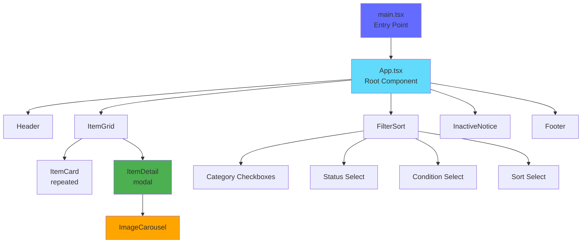

## Component Tree with Props

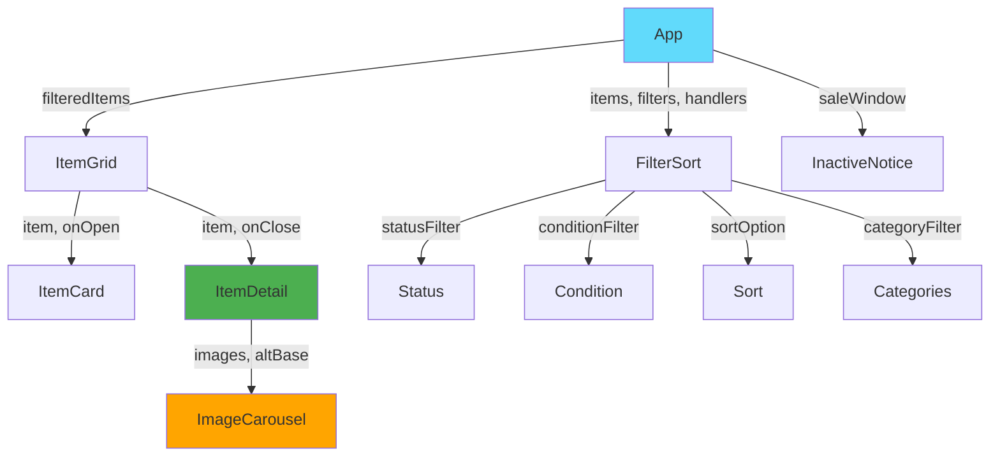

## Detailed Component Specifications

### 1. App.tsx (Root Component)

**Responsibility**: Application orchestration, state management, routing logic

**State:**
```typescript
{
  statusFilter: string;        // "All" | "Available" | "Sold"
  conditionFilter: string;     // "All" | "New" | "Like New" | etc.
  sortOption: string;          // "price-low" | "price-high" | etc.
  categoryFilter: string[];    // ["All"] | ["furniture", "lighting"]
}
```

**Key Features:**
- Manages global filter/sort state
- Computes filtered and sorted items (useMemo)
- Syncs state with URL query parameters
- Determines sale window active/inactive state
- Handles category aggregation and counts

**Props Flow:**

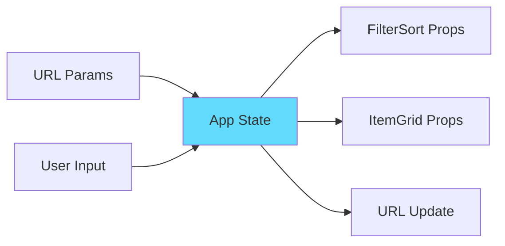

**Code Structure:**
```typescript
function App() {
  // State initialization from URL
  const [statusFilter, setStatusFilter] = useState(initial.status);
  const [conditionFilter, setConditionFilter] = useState(initial.condition);
  const [sortOption, setSortOption] = useState(initial.sort);
  const [categoryFilter, setCategoryFilter] = useState(initial.categories);
  
  // Derived data
  const categories = useMemo(() => extractCategories(ITEMS), []);
  const categoryCounts = useMemo(() => countByCategory(ITEMS), []);
  
  // Filtered and sorted items
  const filteredAndSortedItems = useMemo(() => {
    return filterAndSort(ITEMS, filters);
  }, [statusFilter, conditionFilter, sortOption, categoryFilter]);
  
  // Sync state to URL
  useEffect(() => {
    updateURL(filters);
  }, [statusFilter, conditionFilter, sortOption, categoryFilter]);
  
  // Sale window check
  const isSaleActive = checkSaleWindow();
  
  return isSaleActive ? <MainApp /> : <InactiveNotice />;
}
```

### 2. FilterSort.tsx

**Responsibility**: Render and manage filter/sort controls

**Props:**
```typescript
interface FilterSortProps {
  statusFilter: string;
  conditionFilter: string;
  sortOption: string;
  categoryFilter: string[];
  categories: string[];
  categoryCounts?: Record<string, number>;
  onStatusChange: (status: string) => void;
  onConditionChange: (condition: string) => void;
  onSortChange: (sort: string) => void;
  onCategoryChange: (categories: string[]) => void;
}
```

**Component Structure:**

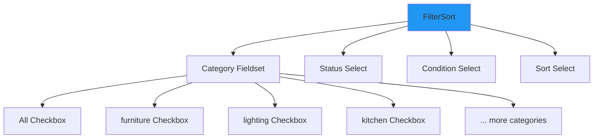

**Features:**
- Multi-select category filter with counts
- Single-select dropdowns for status/condition
- Sort options dropdown
- Accessible with ARIA labels
- Real-time filter application

**Interaction Logic:**
```typescript
// Category multi-select logic
onChange={(e) => {
  const next = new Set(categoryFilter);
  if (e.target.checked) {
    next.delete('All');  // Remove "All" when selecting specific
    next.add(category);
  } else {
    next.delete(category);
  }
  if (next.size === 0) next.add('All');  // Default to "All" if empty
  onCategoryChange(Array.from(next));
}}
```

### 3. ItemGrid.tsx

**Responsibility**: Display grid of item cards and manage detail modal

**Props:**
```typescript
interface ItemGridProps {
  items: Item[];  // Filtered and sorted items
}
```

**State:**
```typescript
{
  selected: Item | null;  // Currently selected item for detail view
}
```

**Layout:**

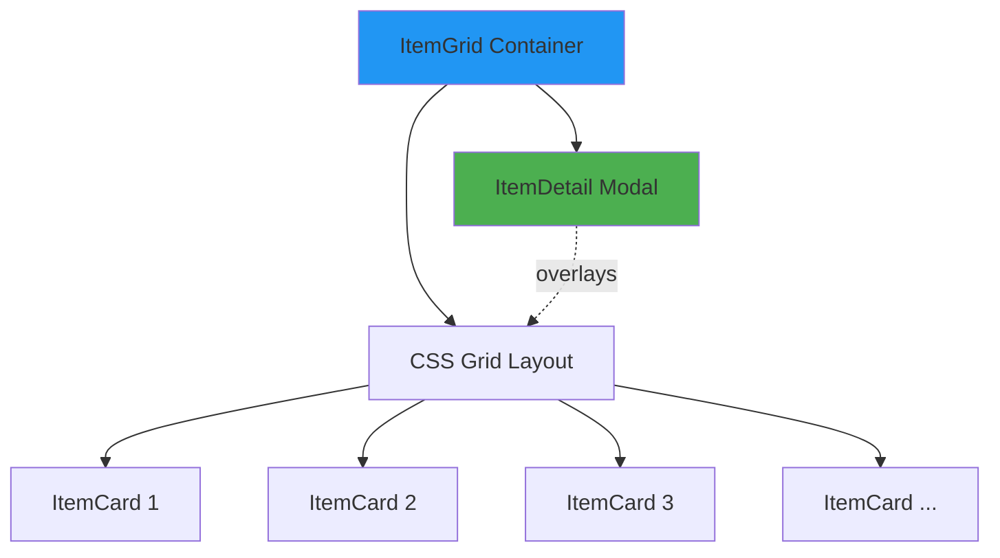

**Responsive Grid:**
```css
.item-grid {
  display: grid;
  grid-template-columns: repeat(auto-fill, minmax(300px, 1fr));
  gap: 2rem;
}
```

**Empty State:**
```typescript
if (visibleItems.length === 0) {
  return (
    <div className="no-items">
      <p>No items match your current filters.</p>
    </div>
  );
}
```

### 4. ItemCard.tsx

**Responsibility**: Display individual item in grid

**Props:**
```typescript
interface ItemCardProps {
  item: Item;
  onOpen?: (item: Item) => void;
}
```

**Component Structure:**

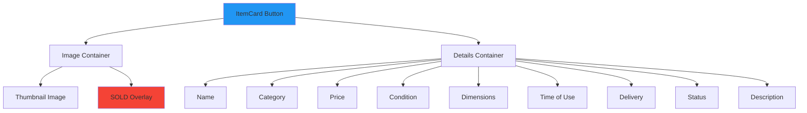

**Visual States:**
- **Available**: Normal appearance, price visible
- **Sold**: Greyed out, "SOLD" overlay, price hidden
- **Hover**: Subtle scale/shadow effect (CSS)
- **Focus**: Clear focus indicator (accessibility)

**Image Strategy:**
```typescript
// Prefer thumbnail for fast loading in grid

```

**Click Behavior:**
```typescript
onClick={() => onOpen && onOpen(item)}
// Triggers modal open in ItemGrid parent
```

### 5. ItemDetail.tsx

**Responsibility**: Display item details in modal overlay

**Props:**
```typescript
interface ItemDetailProps {
  item: Item;
  onClose: () => void;
}
```

**Component Structure:**

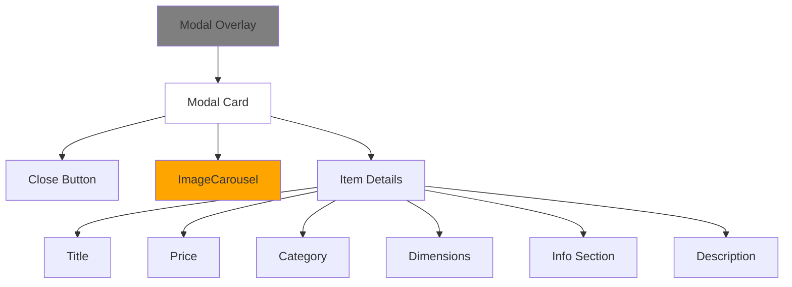

**Modal Behavior:**

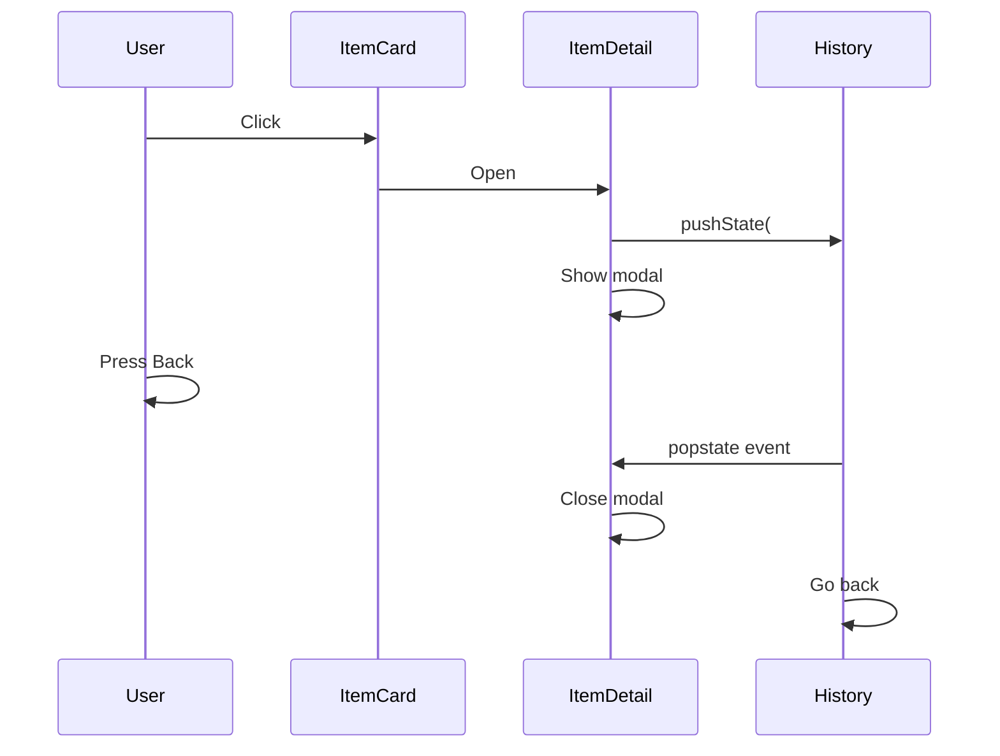

**Features:**
- Modal overlay with backdrop click to close
- Browser back button closes modal
- Escape key closes modal
- Prevents body scroll when open
- Accessible with ARIA attributes
- History API integration

**Lifecycle:**
```typescript
useEffect(() => {
  // Push history state
  window.history.pushState({modal: true, id: item.id}, "", `#item-${item.id}`);
  
  // Prevent body scroll
  document.body.style.overflow = "hidden";
  
  // Listen for back button
  window.addEventListener("popstate", onClose);
  window.addEventListener("keydown", onEscapeKey);
  
  return () => {
    // Cleanup
    window.removeEventListener("popstate", onClose);
    window.removeEventListener("keydown", onEscapeKey);
    document.body.style.overflow = "";
  };
}, [item.id, onClose]);
```

### 6. ImageCarousel.tsx

**Responsibility**: Display swipeable image carousel

**Props:**
```typescript
interface ImageCarouselProps {
  images: (string | ImageDescriptor)[];
  altBase: string;  // Base text for alt attributes
}
```

**Component Structure:**

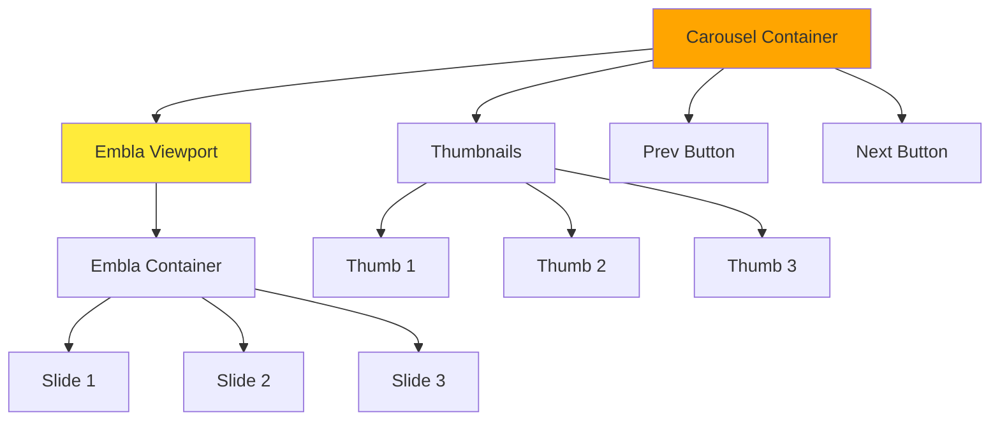

**Features:**
- Touch/swipe gestures on mobile
- Click/tap navigation with buttons
- Keyboard arrow key navigation
- Thumbnail preview strip
- Smooth animations
- Lazy loading images
- Accessible controls

**Embla Carousel Integration:**
```typescript
const [emblaRef, emblaApi] = useEmblaCarousel({
  loop: false,
  align: 'start'
});

// Navigation handlers
const scrollPrev = () => emblaApi?.scrollPrev();
const scrollNext = () => emblaApi?.scrollNext();
const scrollTo = (index: number) => emblaApi?.scrollTo(index);
```

### 7. InactiveNotice.tsx

**Responsibility**: Display notice when sale is not active

**Props:** None (reads constants directly)

**Component Structure:**

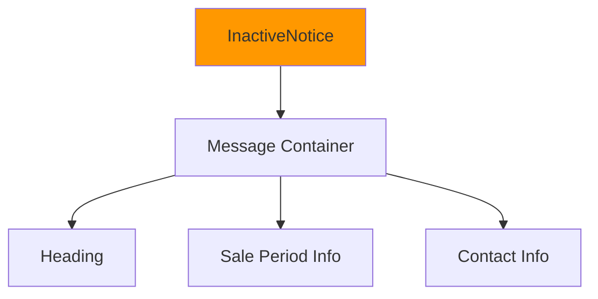

**Features:**
- Shows formatted start/end dates
- Localized date formatting
- Clear messaging about when sale will be active
- Responsive design

**Date Formatting:**
```typescript
const dateFormatter = new Intl.DateTimeFormat(locale, {
  dateStyle: 'full',
  timeZone: 'UTC'
});

const startFormatted = dateFormatter.format(SALE_START);
const endFormatted = dateFormatter.format(SALE_END);
```

## Data Flow

### Props Flow Diagram

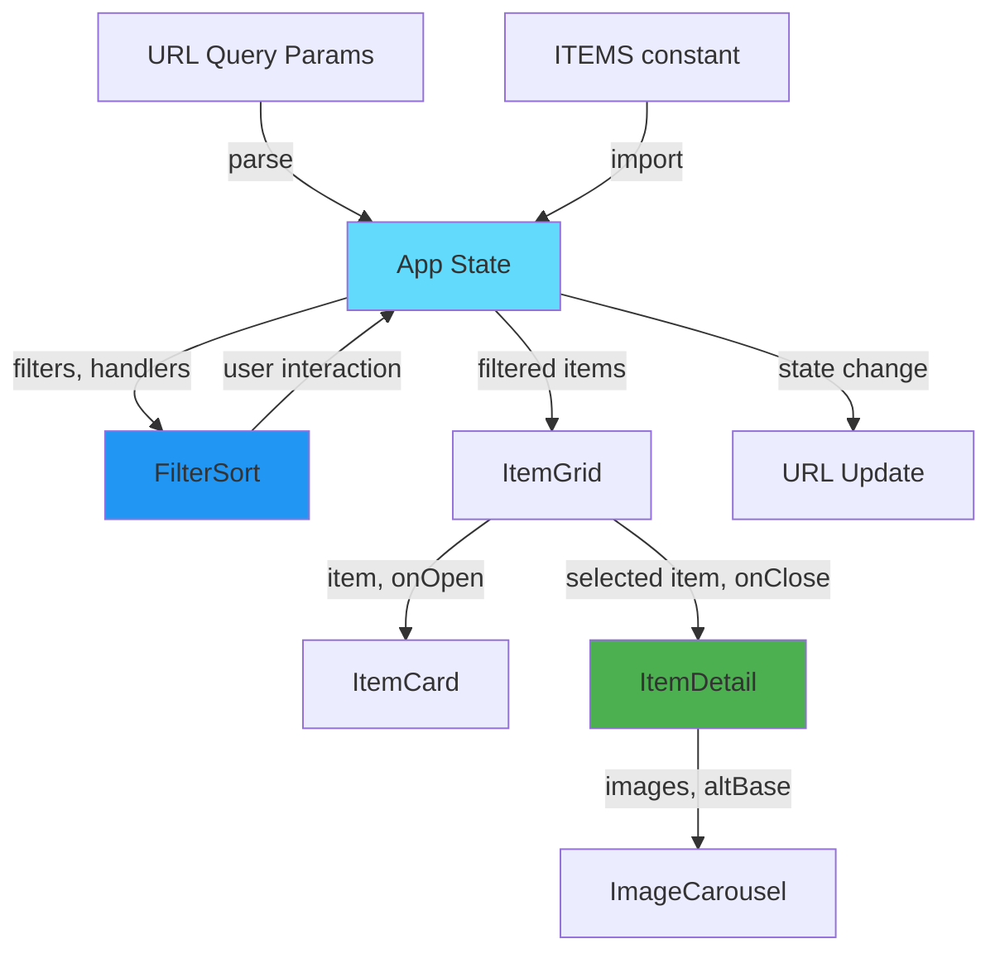

### Event Flow

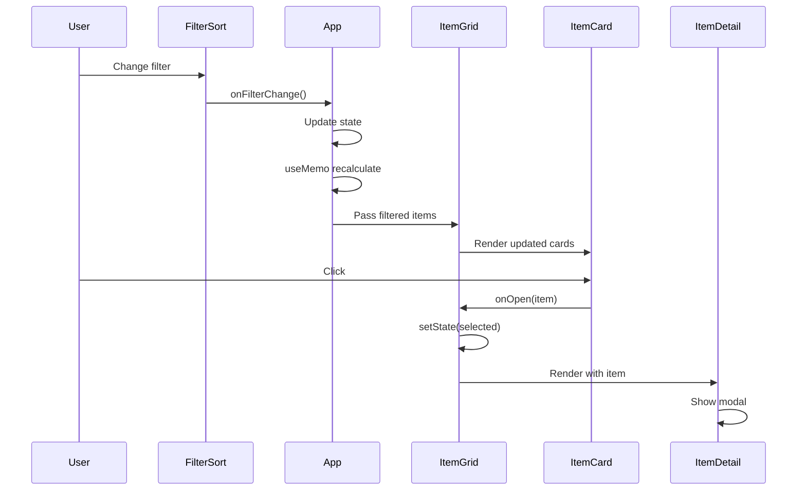

## Component Communication

### Parent-Child Communication

**Downward (Props):**
```typescript
// Parent passes data and callbacks down
<ItemCard item={item} onOpen={handleOpen} />
```

**Upward (Callbacks):**
```typescript
// Child calls parent callback
<button onClick={() => onOpen(item)}>Open</button>
```

### Sibling Communication

Siblings communicate through shared parent state:

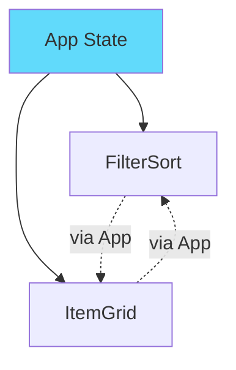

### URL-Based Communication

State persisted to URL for shareability:

```typescript
// Write: App → URL
useEffect(() => {
  const params = new URLSearchParams();
  if (status !== 'All') params.set('status', status);
  window.history.replaceState({}, '', `?${params}`);
}, [status, condition, sort, categories]);

// Read: URL → App
const getInitialFromQuery = () => {
  const params = new URLSearchParams(window.location.search);
  return {
    status: params.get('status') || 'All',
    condition: params.get('condition') || 'All',
    // ...
  };
};
```

## Component Responsibilities Matrix

| Component | UI Rendering | State Management | Business Logic | Side Effects |
|-----------|--------------|------------------|----------------|--------------|
| **App** | ✅ Layout | ✅ Global filters | ✅ Filter/sort logic | ✅ URL sync |
| **FilterSort** | ✅ Controls | ❌ None | ❌ None | ❌ None |
| **ItemGrid** | ✅ Grid layout | ✅ Selected item | ❌ None | ❌ None |
| **ItemCard** | ✅ Card display | ❌ None | ✅ Format data | ❌ None |
| **ItemDetail** | ✅ Modal | ❌ None | ✅ Format data | ✅ History, scroll lock |
| **ImageCarousel** | ✅ Carousel | ✅ Current slide | ❌ None | ✅ Embla init |
| **InactiveNotice** | ✅ Notice | ❌ None | ✅ Date format | ❌ None |

## Performance Optimizations

### Memoization

```typescript
// Expensive computations memoized
const filteredAndSortedItems = useMemo(() => {
  return filterAndSort(ITEMS, filters);
}, [statusFilter, conditionFilter, sortOption, categoryFilter]);

const categories = useMemo(() => {
  return extractCategories(ITEMS);
}, []); // Static data, empty deps
```

### Component Memoization

```typescript
// Future optimization: memo for ItemCard
export const ItemCard = React.memo(({ item, onOpen }: ItemCardProps) => {
  // Component implementation
}, (prevProps, nextProps) => {
  // Custom comparison
  return prevProps.item.id === nextProps.item.id;
});
```

### Image Loading Strategy

```typescript
// List view: thumbnails for fast load


// Detail view: medium quality


// Future: lazy loading with Intersection Observer
```

## Accessibility Features

### Semantic HTML

- `<header>`, `<main>`, `<footer>` landmarks
- `<button>` for all interactive elements
- `<fieldset>` and `<legend>` for grouped controls
- `<label>` for all form inputs

### ARIA Attributes

```typescript
// Modal
<div role="dialog" aria-modal="true" aria-labelledby="item-title-123">

// Buttons
<button aria-label="Open details for Vintage Table">

// Select controls
<select aria-label="Filter by status">
```

### Keyboard Navigation

- Tab order is logical
- All interactive elements focusable
- Escape key closes modal
- Arrow keys in carousel
- Enter activates buttons

See [Sequence Diagrams](./Sequence-Diagrams.md) for detailed interaction flows.

## Testing Strategy

### Component Tests

```typescript
// ItemCard.test.tsx
describe('ItemCard', () => {
  it('renders item details', () => {
    render(<ItemCard item={mockItem} />);
    expect(screen.getByText('Vintage Table')).toBeInTheDocument();
  });
  
  it('calls onOpen when clicked', () => {
    const onOpen = jest.fn();
    render(<ItemCard item={mockItem} onOpen={onOpen} />);
    fireEvent.click(screen.getByRole('button'));
    expect(onOpen).toHaveBeenCalledWith(mockItem);
  });
});
```

### Accessibility Tests

```typescript
// ItemDetail.a11y.test.tsx
it('has no accessibility violations', async () => {
  const { container } = render(<ItemDetail item={mockItem} onClose={jest.fn()} />);
  const results = await axe(container);
  expect(results).toHaveNoViolations();
});
```

## Future Enhancements

Potential component improvements:

1. **Search Component** - Client-side fuzzy search
2. **Pagination Component** - For large item counts
3. **Lightbox Component** - Full-screen image zoom
4. **ShareButton Component** - Social media sharing
5. **Breadcrumbs Component** - Navigation context
6. **Toast Component** - User feedback notifications

---

**Last Updated**: November 2025
