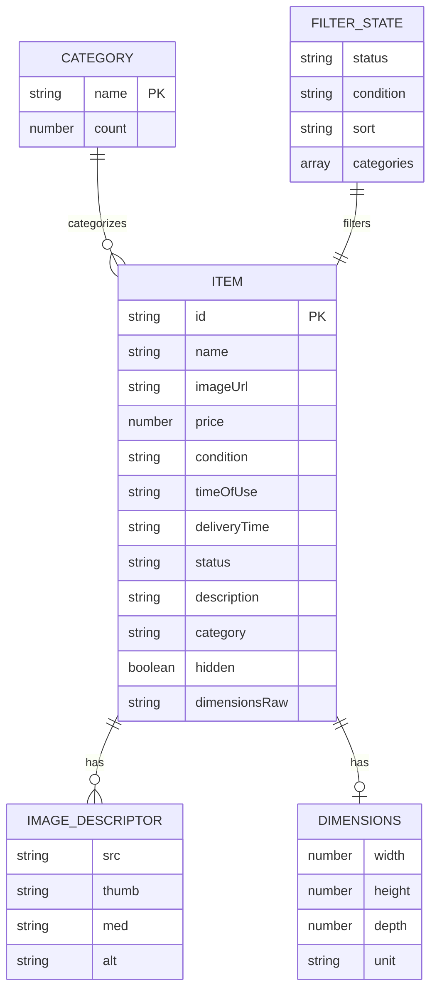
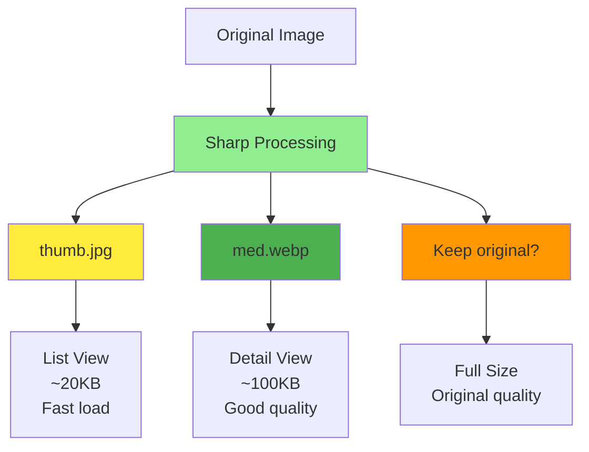
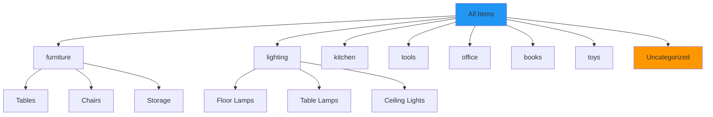
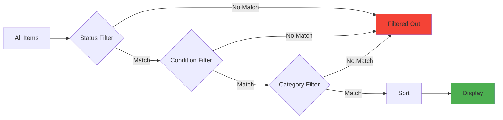
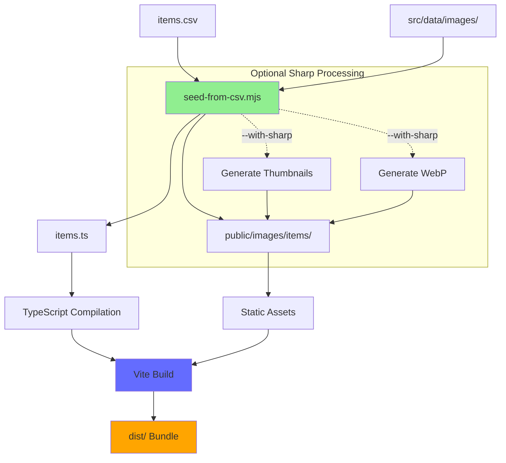
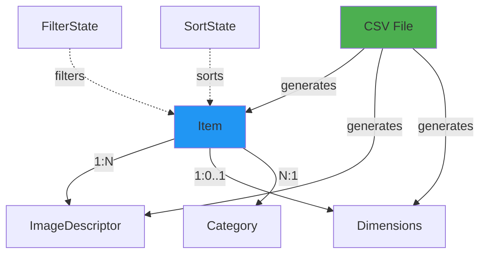

# Database Schema & Data Model

This document describes the data model used in the Garage Sale application. While there is no traditional database, the application uses a structured data model compiled from CSV files at build time.

## Entity Relationship Diagram (ERM)



## Data Entities

### Item

The core entity representing a garage sale item.

**Interface Definition:**

```typescript
export interface Item {
  // Required fields
  id: string;                    // Unique identifier
  name: string;                  // Item name/title
  imageUrl: string;              // Primary image URL
  price: number;                 // Price in USD
  
  // Optional metadata
  category?: string;             // Category (furniture, lighting, etc.)
  condition?: "New" | "Like New" | "Good" | "Fair" | "Poor";
  timeOfUse?: string;            // Usage duration or date
  deliveryTime?: string;         // Delivery/pickup info
  status?: "Available" | "Sold" | string;
  description?: string;          // Detailed description
  hidden?: boolean;              // Hide from listings
  
  // Dimensions
  dimensionsRaw?: string;        // Raw dimension string from CSV
  dimensions?: Dimensions | string;  // Parsed or string dimensions
  
  // Images
  images?: ImageDescriptor[];     // Legacy image array
  primaryImage?: ImageDescriptor; // Primary image descriptor
  imagesMeta?: ImageDescriptor[]; // Image metadata from seeder
  primarySizes?: SizeVariants;   // Convenience alias for first image
}
```

**Field Details:**

| Field | Type | Required | Description | Example |
|-------|------|----------|-------------|---------|
| `id` | string | ✅ Yes | Unique identifier | "1", "item-42" |
| `name` | string | ✅ Yes | Item name | "Vintage Table" |
| `imageUrl` | string | ✅ Yes | Primary image URL | "/images/items/table/main.jpg" |
| `price` | number | ✅ Yes | Price in dollars | 75.00 |
| `category` | string | No | Item category | "furniture", "lighting" |
| `condition` | enum | No | Item condition | "New", "Like New", "Good", "Fair", "Poor" |
| `timeOfUse` | string | No | Usage duration | "3 years", "2 months" |
| `deliveryTime` | string | No | Delivery info | "Pickup only", "Can deliver" |
| `status` | enum | No | Availability | "Available", "Sold" |
| `description` | string | No | Full description | "Small mid-century side table..." |
| `hidden` | boolean | No | Hide from view | true, false |
| `dimensionsRaw` | string | No | Original size string | "30 x 20 x 30 in" |
| `dimensions` | Dimensions\|string | No | Parsed dimensions | `{width: 30, height: 20, depth: 30, unit: "in"}` |

**Business Rules:**

- `id` must be unique across all items
- `price` must be non-negative
- `status` defaults to "Available" if not specified
- `hidden` items are filtered out from display
- `condition` affects search/filter behavior

### ImageDescriptor

Represents image variants for an item (thumbnails, medium, full size).

**Interface Definition:**

```typescript
export interface ImageDescriptor {
  src: string;      // Primary source URL (may be med.webp when available)
  thumb?: string;   // Small thumbnail variant (jpg, ~20KB)
  med?: string;     // Medium WebP variant for detail view (~100KB)
  alt?: string;     // Accessible alt text from seeder
}

// Type alias for backward compatibility
export type SizeVariants = ImageDescriptor;
```

**Image Variant Strategy:**



**Usage Patterns:**

- **List View**: Use `thumb` for fast loading grid
- **Detail View**: Use `med` for good quality modal
- **Full View**: Use `src` for zoom/download (future)

### Dimensions

Structured representation of item physical dimensions.

**Interface Definition:**

```typescript
export interface Dimensions {
  width?: number;   // Width in units
  height?: number;  // Height in units
  depth?: number;   // Depth in units
  unit?: string;    // Unit of measurement (in, cm, mm)
}
```

**Parsing Examples:**

| Input (dimensionsRaw) | Parsed Output |
|-----------------------|---------------|
| "30 x 20 x 30 in" | `{width: 30, height: 20, depth: 30, unit: "in"}` |
| "100 x 50 cm" | `{width: 100, height: 50, unit: "cm"}` |
| "60 x 12 in" | `{width: 60, height: 12, unit: "in"}` |
| "12×8×2 in" | `{width: 12, height: 8, depth: 2, unit: "in"}` |

**Display Format:**

```typescript
// Formatted as: "30 x 20 x 30 in"
function formatDimensions(dim: Dimensions): string {
  const parts = [];
  if (dim.width != null) parts.push(String(dim.width));
  if (dim.height != null) parts.push(String(dim.height));
  if (dim.depth != null) parts.push(String(dim.depth));
  return parts.join(' x ') + (dim.unit ? ` ${dim.unit}` : '');
}
```

### Category

Logical grouping of items (not a stored entity, derived from items).

**Derived Data:**

```typescript
// Categories are extracted from items
const categories = new Set(items.map(i => i.category).filter(Boolean));
// Result: ["furniture", "lighting", "kitchen", "tools", "office", "books", "toys"]

// Category counts
const categoryCounts: Record<string, number> = {};
for (const item of items) {
  const cat = item.category || 'Uncategorized';
  categoryCounts[cat] = (categoryCounts[cat] || 0) + 1;
}
```

**Category Hierarchy:**



### FilterState

Client-side filter and sort state (not persisted to database).

**State Structure:**

```typescript
interface FilterState {
  status: string;          // "All" | "Available" | "Sold"
  condition: string;       // "All" | "New" | "Like New" | "Good" | "Fair" | "Poor"
  sort: string;           // "price-low" | "price-high" | "name-asc" | "name-desc"
  categories: string[];   // ["All"] | ["furniture", "lighting"]
}
```

**URL Persistence:**

Filters are persisted to URL query parameters:

```
?status=Available&condition=Good&sort=price-low&categories=furniture,lighting
```

**Filter Logic:**



## CSV Data Format

### CSV Schema

The `src/data/items.csv` file uses the following schema:

```csv
id,name,folder,category,dimensions,price,condition,timeOfUse,deliveryTime,status,hidden,description
```

**Column Definitions:**

| Column | Type | Required | Description |
|--------|------|----------|-------------|
| id | string | Yes | Unique identifier |
| name | string | Yes | Item name |
| folder | string | No | Image folder name in `src/data/images/` |
| category | string | No | Category tag |
| dimensions | string | No | Size string (e.g., "30 x 20 x 30 in") |
| price | number | Yes | Price in dollars |
| condition | enum | No | Condition rating |
| timeOfUse | string | No | Usage duration |
| deliveryTime | string | No | Delivery/pickup info |
| status | enum | No | Available or Sold |
| hidden | boolean | No | Hide from listings |
| description | string | No | Full description |

### CSV Example

```csv
id,name,folder,category,dimensions,price,condition,timeOfUse,deliveryTime,status,hidden,description
1,Vintage Table,table1,furniture,30 x 20 x 30 in,75,Good,3 years,Pickup only,Available,false,Small mid-century side table with minor surface wear
2,Classic Floor Lamp,lamp1,lighting,60 x 12 in,45,Good,5 years,Pickup or local delivery,Available,false,Brass floor lamp with fabric shade
3,Kids Toy Set,toys1,toys,,25,Like New,6 months,Pickup only,Sold,false,Educational toy set for ages 3-6
```

## Data Generation Pipeline



**Pipeline Steps:**

1. **CSV Input**: Edit `src/data/items.csv`
2. **Image Preparation**: Place images in `src/data/images/<folder>/`
3. **Seeder Execution**: Run `node scripts/seed-from-csv.mjs [--with-sharp]`
4. **TypeScript Generation**: Produces `src/data/items.ts`
5. **Image Processing**: Copies/optimizes images to `public/images/items/`
6. **Build Integration**: Vite includes data in bundle

## Data Validation

### Type Safety

TypeScript provides compile-time validation:

```typescript
// Type checking at compile time
const item: Item = {
  id: "1",
  name: "Table",
  imageUrl: "/images/table.jpg",
  price: 75,
  condition: "Good",  // Must be valid enum value
  status: "Available" // Must be valid enum value
};

// TypeScript errors on invalid data
const invalid: Item = {
  id: "2",
  name: "Lamp",
  imageUrl: "/images/lamp.jpg",
  price: "forty-five",  // ❌ Error: Type 'string' is not assignable to type 'number'
  condition: "Perfect"   // ❌ Error: Type '"Perfect"' is not assignable to type 'Condition'
};
```

### Runtime Validation

The seeder script validates CSV data:

```javascript
// Seed script validation
function validateItem(row) {
  if (!row.id) throw new Error("Missing required field: id");
  if (!row.name) throw new Error("Missing required field: name");
  if (!row.price || isNaN(parseFloat(row.price))) {
    throw new Error(`Invalid price: ${row.price}`);
  }
  // ... more validations
}
```

## Data Constraints

### Business Constraints

- **Uniqueness**: Item IDs must be unique
- **Price**: Must be non-negative number
- **Status**: Limited to defined enum values
- **Condition**: Limited to defined enum values
- **Hidden**: Items marked hidden won't appear in listings

### Technical Constraints

- **Bundle Size**: ~100-1000 items recommended (client-side filtering)
- **Image Size**: Optimize images to reduce bundle size
- **CSV Format**: Must be valid UTF-8 encoded CSV

## Data Relationships



## Query Patterns

### Filtering Items

```typescript
// Filter by status
const available = items.filter(item => item.status === "Available");

// Filter by condition
const goodCondition = items.filter(item => item.condition === "Good");

// Filter by category
const furniture = items.filter(item => item.category === "furniture");

// Multi-filter
const availableFurniture = items.filter(
  item => item.status === "Available" && item.category === "furniture"
);
```

### Sorting Items

```typescript
// Sort by price ascending
const byPriceLow = [...items].sort((a, b) => a.price - b.price);

// Sort by price descending
const byPriceHigh = [...items].sort((a, b) => b.price - a.price);

// Sort by name
const byName = [...items].sort((a, b) => a.name.localeCompare(b.name));
```

### Aggregating Data

```typescript
// Count by category
const categoryCounts = items.reduce((acc, item) => {
  const cat = item.category || 'Uncategorized';
  acc[cat] = (acc[cat] || 0) + 1;
  return acc;
}, {} as Record<string, number>);

// Average price by category
const avgPrices = Object.entries(
  items.reduce((acc, item) => {
    const cat = item.category || 'Uncategorized';
    if (!acc[cat]) acc[cat] = { sum: 0, count: 0 };
    acc[cat].sum += item.price;
    acc[cat].count++;
    return acc;
  }, {} as Record<string, {sum: number, count: number}>)
).map(([cat, {sum, count}]) => ({
  category: cat,
  avgPrice: sum / count
}));
```

## Data Migration

### Future Database Migration Path

If the application needs a real database in the future:

1. **Export Current Data**
   ```typescript
   // items.ts already in structured format
   const itemsJson = JSON.stringify(ITEMS, null, 2);
   ```

2. **Choose Database**
   - Firebase Firestore (NoSQL, good for this use case)
   - PostgreSQL (SQL, more structured)
   - MongoDB (NoSQL, flexible schema)

3. **Create Schema**
   ```sql
   -- PostgreSQL example
   CREATE TABLE items (
     id VARCHAR PRIMARY KEY,
     name VARCHAR NOT NULL,
     image_url VARCHAR NOT NULL,
     price DECIMAL(10,2) NOT NULL,
     category VARCHAR,
     condition VARCHAR,
     status VARCHAR DEFAULT 'Available',
     created_at TIMESTAMP DEFAULT NOW()
   );
   ```

4. **Migrate Data**
   ```typescript
   // Import script
   for (const item of ITEMS) {
     await db.collection('items').doc(item.id).set(item);
   }
   ```

---

**Last Updated**: November 2025
