# Sequence Diagrams

This document illustrates the key user interaction flows and system behaviors using sequence diagrams.

## Table of Contents

1. [Application Initialization](#1-application-initialization)
2. [Item Browsing Flow](#2-item-browsing-flow)
3. [Filter and Sort Flow](#3-filter-and-sort-flow)
4. [Item Detail View Flow](#4-item-detail-view-flow)
5. [Image Carousel Navigation](#5-image-carousel-navigation)
6. [Modal Close Flow](#6-modal-close-flow)
7. [Sale Window Check](#7-sale-window-check)
8. [Data Seeding Flow](#8-data-seeding-flow)

---

## 1. Application Initialization

This diagram shows what happens when a user first loads the application.

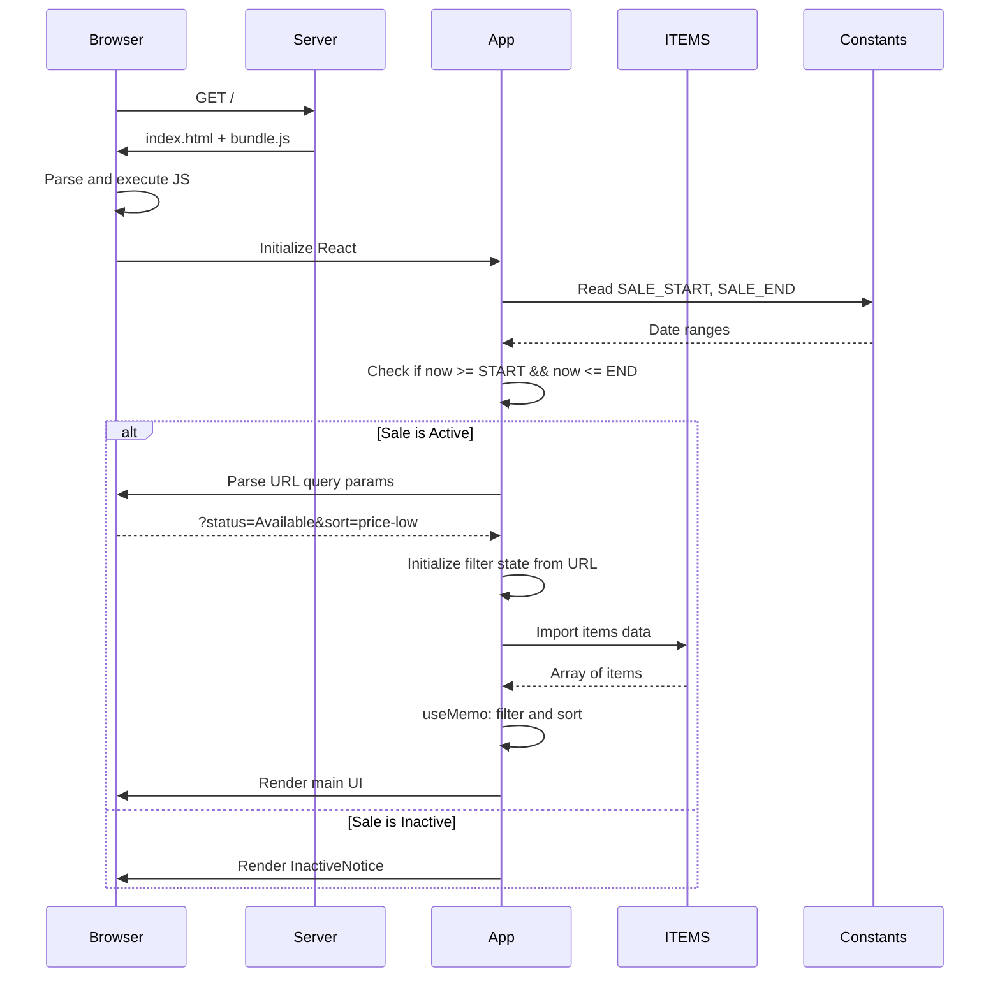
```mermaid
sequenceDiagram
    participant Browser
    participant Server
    participant App
    participant ITEMS
    participant Constants
    
    Browser->>Server: GET /
    Server->>Browser: index.html + bundle.js
    Browser->>Browser: Parse and execute JS
    Browser->>App: Initialize React
    
    App->>Constants: Read SALE_START, SALE_END
    Constants-->>App: Date ranges
    App->>App: Check if now >= START && now <= END
    
    alt Sale is Active
        App->>Browser: Parse URL query params
        Browser-->>App: ?status=Available&sort=price-low
        App->>App: Initialize filter state from URL
        App->>ITEMS: Import items data
        ITEMS-->>App: Array of items
        App->>App: useMemo: filter and sort
        App->>Browser: Render main UI
    else Sale is Inactive
        App->>Browser: Render InactiveNotice
    end
```

**Key Points:**
- Application checks sale window immediately on load
- URL parameters restore filter state for shared links
- Items data is bundled with JavaScript (no API call)
- Filtering/sorting computed client-side with useMemo

---

## 2. Item Browsing Flow

Basic flow of browsing items in the grid.

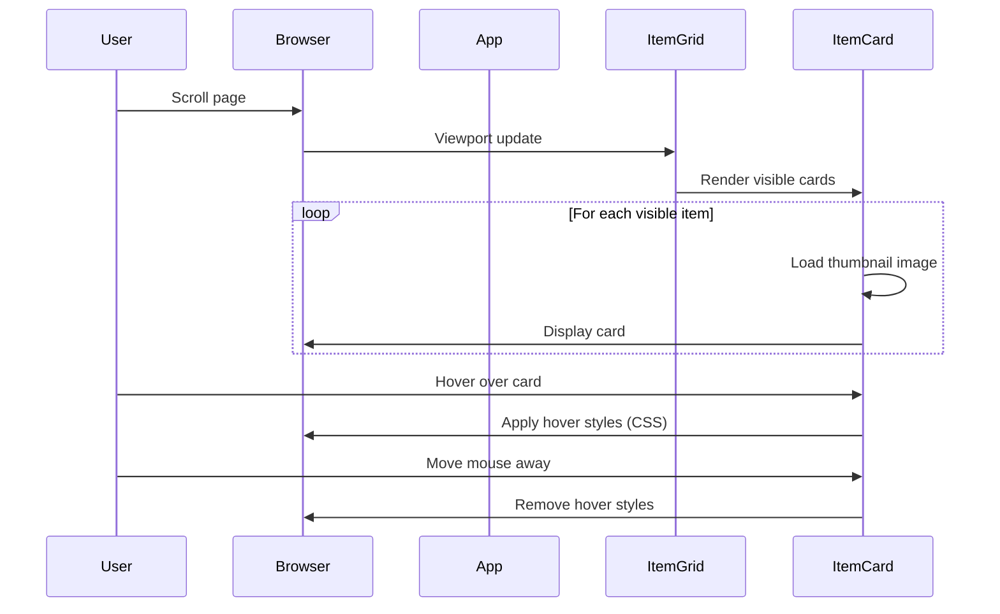
```mermaid
sequenceDiagram
    participant User
    participant Browser
    participant App
    participant ItemGrid
    participant ItemCard
    
    User->>Browser: Scroll page
    Browser->>ItemGrid: Viewport update
    ItemGrid->>ItemCard: Render visible cards
    
    loop For each visible item
        ItemCard->>ItemCard: Load thumbnail image
        ItemCard->>Browser: Display card
    end
    
    User->>ItemCard: Hover over card
    ItemCard->>Browser: Apply hover styles (CSS)
    
    User->>ItemCard: Move mouse away
    ItemCard->>Browser: Remove hover styles
```

**Key Points:**
- All items render immediately (no lazy loading yet)
- Thumbnails used for fast loading
- CSS handles hover effects (no JavaScript)

---

## 3. Filter and Sort Flow

User interaction with filters and sort controls.

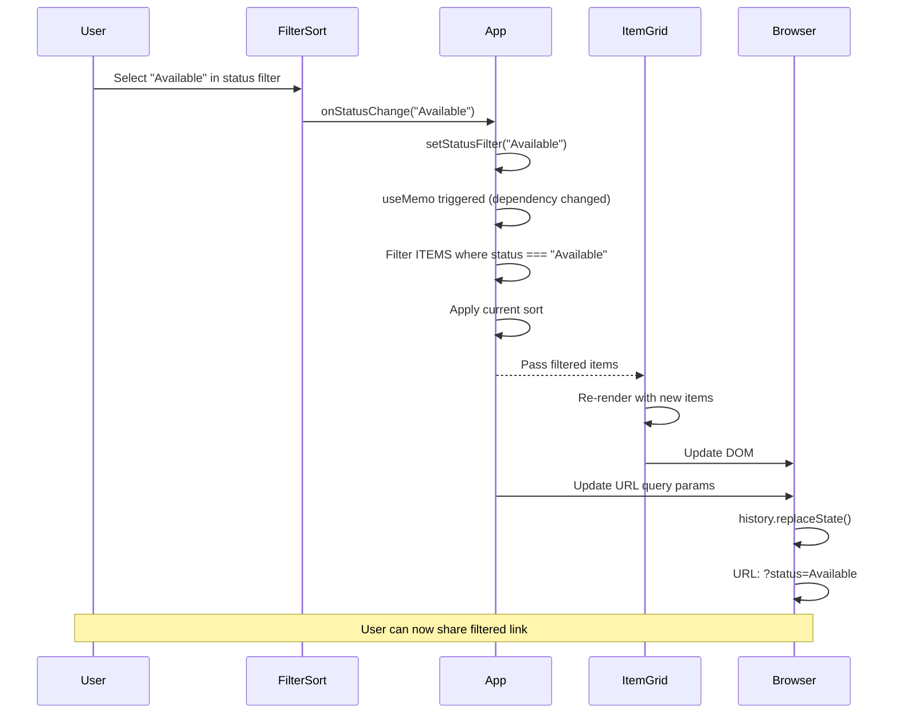
```mermaid
sequenceDiagram
    participant User
    participant FilterSort
    participant App
    participant ItemGrid
    participant Browser
    
    User->>FilterSort: Select "Available" in status filter
    FilterSort->>App: onStatusChange("Available")
    App->>App: setStatusFilter("Available")
    
    App->>App: useMemo triggered (dependency changed)
    App->>App: Filter ITEMS where status === "Available"
    App->>App: Apply current sort
    App-->>ItemGrid: Pass filtered items
    
    ItemGrid->>ItemGrid: Re-render with new items
    ItemGrid->>Browser: Update DOM
    
    App->>Browser: Update URL query params
    Browser->>Browser: history.replaceState()
    Browser->>Browser: URL: ?status=Available
    
    Note over User,Browser: User can now share filtered link
```

**Multi-Category Filter Flow:**

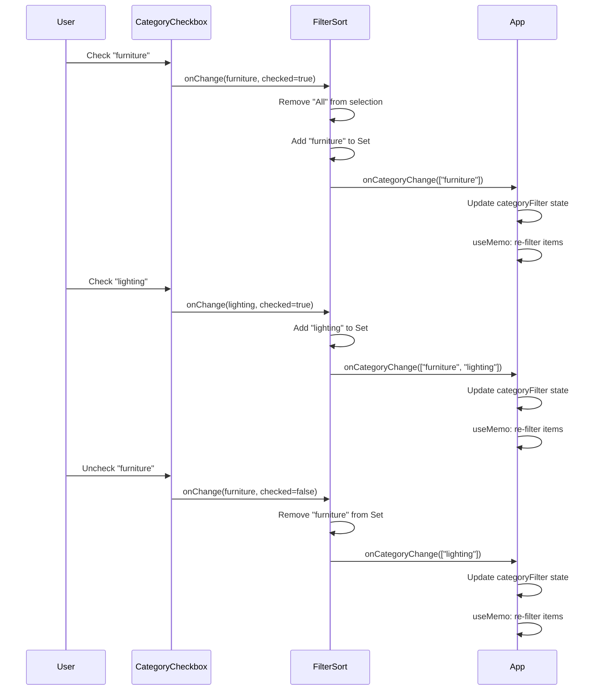
```mermaid
sequenceDiagram
    participant User
    participant CategoryCheckbox
    participant FilterSort
    participant App
    
    User->>CategoryCheckbox: Check "furniture"
    CategoryCheckbox->>FilterSort: onChange(furniture, checked=true)
    FilterSort->>FilterSort: Remove "All" from selection
    FilterSort->>FilterSort: Add "furniture" to Set
    FilterSort->>App: onCategoryChange(["furniture"])
    App->>App: Update categoryFilter state
    App->>App: useMemo: re-filter items
    
    User->>CategoryCheckbox: Check "lighting"
    CategoryCheckbox->>FilterSort: onChange(lighting, checked=true)
    FilterSort->>FilterSort: Add "lighting" to Set
    FilterSort->>App: onCategoryChange(["furniture", "lighting"])
    App->>App: Update categoryFilter state
    App->>App: useMemo: re-filter items
    
    User->>CategoryCheckbox: Uncheck "furniture"
    CategoryCheckbox->>FilterSort: onChange(furniture, checked=false)
    FilterSort->>FilterSort: Remove "furniture" from Set
    FilterSort->>App: onCategoryChange(["lighting"])
    App->>App: Update categoryFilter state
    App->>App: useMemo: re-filter items
```

**Key Points:**
- Each filter change triggers immediate re-render
- useMemo prevents unnecessary recalculation
- URL updates for shareability
- Category filter supports multi-select

---

## 4. Item Detail View Flow

Opening an item detail modal with history integration.

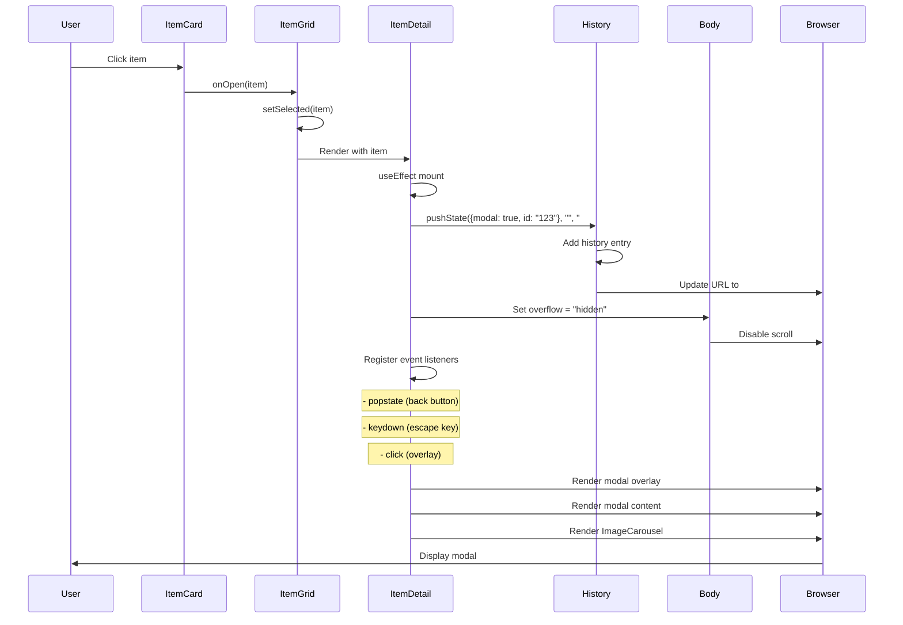
```mermaid
sequenceDiagram
    participant User
    participant ItemCard
    participant ItemGrid
    participant ItemDetail
    participant History
    participant Body
    
    User->>ItemCard: Click item
    ItemCard->>ItemGrid: onOpen(item)
    ItemGrid->>ItemGrid: setSelected(item)
    ItemGrid->>ItemDetail: Render with item
    
    ItemDetail->>ItemDetail: useEffect mount
    ItemDetail->>History: pushState({modal: true, id: "123"}, "", "#item-123")
    History->>History: Add history entry
    History->>Browser: Update URL to #item-123
    
    ItemDetail->>Body: Set overflow = "hidden"
    Body->>Browser: Disable scroll
    
    ItemDetail->>ItemDetail: Register event listeners
    Note over ItemDetail: - popstate (back button)
    Note over ItemDetail: - keydown (escape key)
    Note over ItemDetail: - click (overlay)
    
    ItemDetail->>Browser: Render modal overlay
    ItemDetail->>Browser: Render modal content
    ItemDetail->>Browser: Render ImageCarousel
    
    Browser->>User: Display modal
```

**Direct Link to Item:**

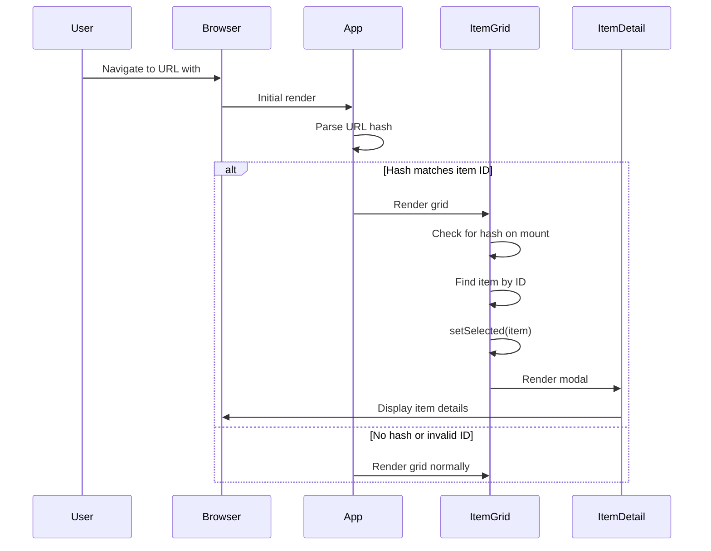
```mermaid
sequenceDiagram
    participant User
    participant Browser
    participant App
    participant ItemGrid
    participant ItemDetail
    
    User->>Browser: Navigate to URL with #item-123
    Browser->>App: Initial render
    App->>App: Parse URL hash
    
    alt Hash matches item ID
        App->>ItemGrid: Render grid
        ItemGrid->>ItemGrid: Check for hash on mount
        ItemGrid->>ItemGrid: Find item by ID
        ItemGrid->>ItemGrid: setSelected(item)
        ItemGrid->>ItemDetail: Render modal
        ItemDetail->>Browser: Display item details
    else No hash or invalid ID
        App->>ItemGrid: Render grid normally
    end
```

**Key Points:**
- History API enables back button support
- URL hash allows direct linking to items
- Body scroll locked while modal open
- Multiple close methods supported

---

## 5. Image Carousel Navigation

Interacting with the image carousel in item detail modal.

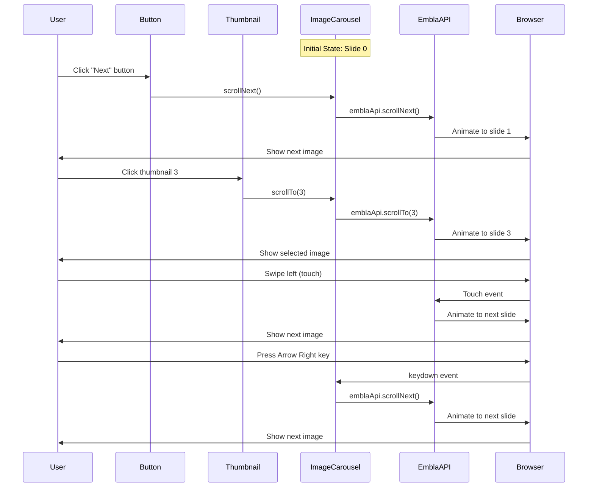
```mermaid
sequenceDiagram
    participant User
    participant Button
    participant Thumbnail
    participant ImageCarousel
    participant EmblaAPI
    participant Browser
    
    Note over ImageCarousel: Initial State: Slide 0
    
    User->>Button: Click "Next" button
    Button->>ImageCarousel: scrollNext()
    ImageCarousel->>EmblaAPI: emblaApi.scrollNext()
    EmblaAPI->>Browser: Animate to slide 1
    Browser->>User: Show next image
    
    User->>Thumbnail: Click thumbnail 3
    Thumbnail->>ImageCarousel: scrollTo(3)
    ImageCarousel->>EmblaAPI: emblaApi.scrollTo(3)
    EmblaAPI->>Browser: Animate to slide 3
    Browser->>User: Show selected image
    
    User->>Browser: Swipe left (touch)
    Browser->>EmblaAPI: Touch event
    EmblaAPI->>Browser: Animate to next slide
    Browser->>User: Show next image
    
    User->>Browser: Press Arrow Right key
    Browser->>ImageCarousel: keydown event
    ImageCarousel->>EmblaAPI: emblaApi.scrollNext()
    EmblaAPI->>Browser: Animate to next slide
    Browser->>User: Show next image
```

**Keyboard Navigation:**

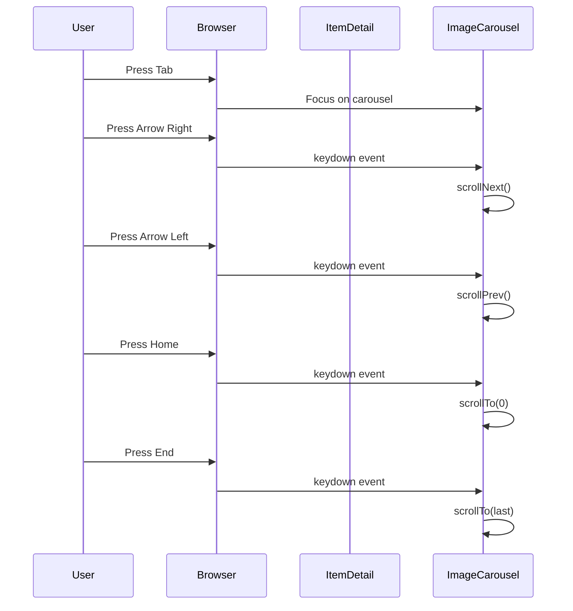
```mermaid
sequenceDiagram
    participant User
    participant Browser
    participant ItemDetail
    participant ImageCarousel
    
    User->>Browser: Press Tab
    Browser->>ImageCarousel: Focus on carousel
    
    User->>Browser: Press Arrow Right
    Browser->>ImageCarousel: keydown event
    ImageCarousel->>ImageCarousel: scrollNext()
    
    User->>Browser: Press Arrow Left
    Browser->>ImageCarousel: keydown event
    ImageCarousel->>ImageCarousel: scrollPrev()
    
    User->>Browser: Press Home
    Browser->>ImageCarousel: keydown event
    ImageCarousel->>ImageCarousel: scrollTo(0)
    
    User->>Browser: Press End
    Browser->>ImageCarousel: keydown event
    ImageCarousel->>ImageCarousel: scrollTo(last)
```

**Key Points:**
- Multiple input methods supported (click, touch, keyboard)
- Smooth animations via Embla Carousel
- Thumbnail navigation for quick access
- Accessible keyboard controls

---

## 6. Modal Close Flow

Various ways to close the item detail modal.

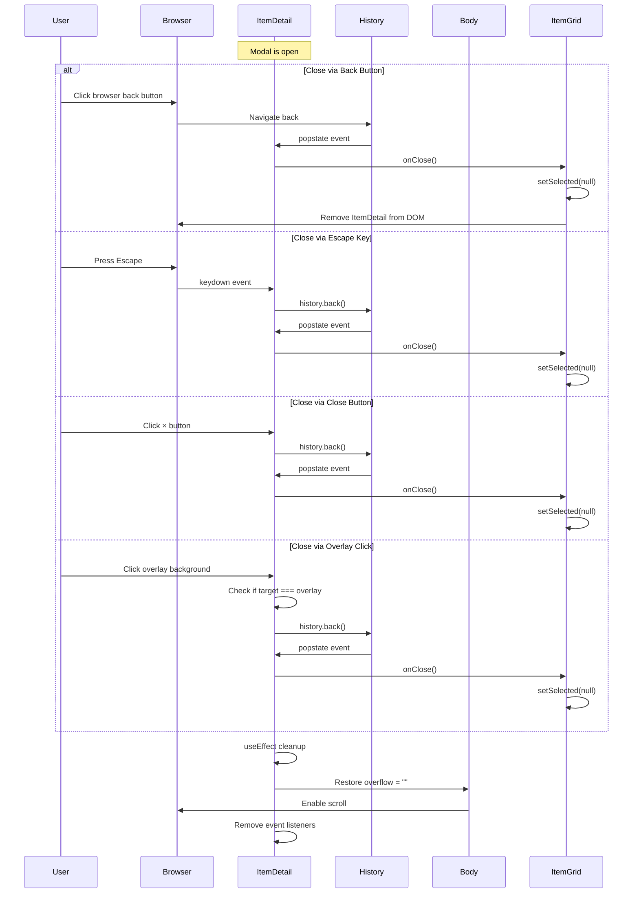
```mermaid
sequenceDiagram
    participant User
    participant Browser
    participant ItemDetail
    participant History
    participant Body
    participant ItemGrid
    
    Note over ItemDetail: Modal is open
    
    alt Close via Back Button
        User->>Browser: Click browser back button
        Browser->>History: Navigate back
        History->>ItemDetail: popstate event
        ItemDetail->>ItemGrid: onClose()
        ItemGrid->>ItemGrid: setSelected(null)
        ItemGrid->>Browser: Remove ItemDetail from DOM
    else Close via Escape Key
        User->>Browser: Press Escape
        Browser->>ItemDetail: keydown event
        ItemDetail->>History: history.back()
        History->>ItemDetail: popstate event
        ItemDetail->>ItemGrid: onClose()
        ItemGrid->>ItemGrid: setSelected(null)
    else Close via Close Button
        User->>ItemDetail: Click × button
        ItemDetail->>History: history.back()
        History->>ItemDetail: popstate event
        ItemDetail->>ItemGrid: onClose()
        ItemGrid->>ItemGrid: setSelected(null)
    else Close via Overlay Click
        User->>ItemDetail: Click overlay background
        ItemDetail->>ItemDetail: Check if target === overlay
        ItemDetail->>History: history.back()
        History->>ItemDetail: popstate event
        ItemDetail->>ItemGrid: onClose()
        ItemGrid->>ItemGrid: setSelected(null)
    end
    
    ItemDetail->>ItemDetail: useEffect cleanup
    ItemDetail->>Body: Restore overflow = ""
    Body->>Browser: Enable scroll
    ItemDetail->>ItemDetail: Remove event listeners
```

**Key Points:**
- All close methods go through history.back()
- Ensures URL and state stay in sync
- Body scroll restored on close
- Event listeners cleaned up properly

---

## 7. Sale Window Check

How the application determines if the sale is active.

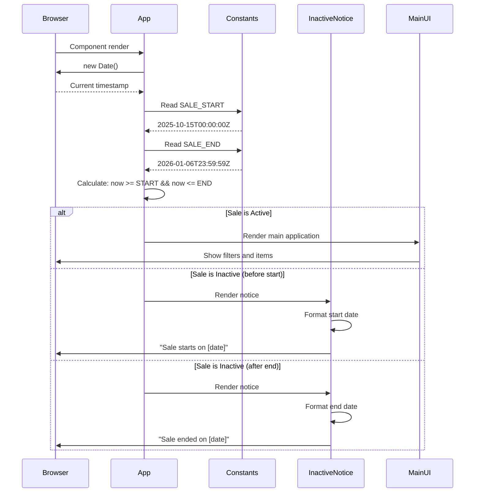
```mermaid
sequenceDiagram
    participant Browser
    participant App
    participant Constants
    participant InactiveNotice
    participant MainUI
    
    Browser->>App: Component render
    App->>Browser: new Date()
    Browser-->>App: Current timestamp
    
    App->>Constants: Read SALE_START
    Constants-->>App: 2025-10-15T00:00:00Z
    
    App->>Constants: Read SALE_END
    Constants-->>App: 2026-01-06T23:59:59Z
    
    App->>App: Calculate: now >= START && now <= END
    
    alt Sale is Active
        App->>MainUI: Render main application
        MainUI->>Browser: Show filters and items
    else Sale is Inactive (before start)
        App->>InactiveNotice: Render notice
        InactiveNotice->>InactiveNotice: Format start date
        InactiveNotice->>Browser: "Sale starts on [date]"
    else Sale is Inactive (after end)
        App->>InactiveNotice: Render notice
        InactiveNotice->>InactiveNotice: Format end date
        InactiveNotice->>Browser: "Sale ended on [date]"
    end
```

**Key Points:**
- Check happens on every render (fast operation)
- Uses browser's local timezone for display
- UTC timestamps in code for consistency
- No server-side logic needed

---

## 8. Data Seeding Flow

How items data is generated from CSV and images.

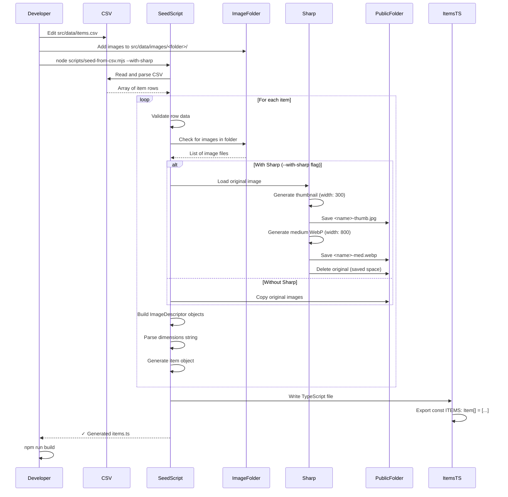
```mermaid
sequenceDiagram
    participant Developer
    participant CSV
    participant SeedScript
    participant ImageFolder
    participant Sharp
    participant PublicFolder
    participant ItemsTS
    
    Developer->>CSV: Edit src/data/items.csv
    Developer->>ImageFolder: Add images to src/data/images/<folder>/
    
    Developer->>SeedScript: node scripts/seed-from-csv.mjs --with-sharp
    
    SeedScript->>CSV: Read and parse CSV
    CSV-->>SeedScript: Array of item rows
    
    loop For each item
        SeedScript->>SeedScript: Validate row data
        SeedScript->>ImageFolder: Check for images in folder
        ImageFolder-->>SeedScript: List of image files
        
        alt With Sharp (--with-sharp flag)
            SeedScript->>Sharp: Load original image
            Sharp->>Sharp: Generate thumbnail (width: 300)
            Sharp->>PublicFolder: Save <name>-thumb.jpg
            Sharp->>Sharp: Generate medium WebP (width: 800)
            Sharp->>PublicFolder: Save <name>-med.webp
            Sharp->>PublicFolder: Delete original (saved space)
        else Without Sharp
            SeedScript->>PublicFolder: Copy original images
        end
        
        SeedScript->>SeedScript: Build ImageDescriptor objects
        SeedScript->>SeedScript: Parse dimensions string
        SeedScript->>SeedScript: Generate item object
    end
    
    SeedScript->>ItemsTS: Write TypeScript file
    ItemsTS->>ItemsTS: Export const ITEMS: Item[] = [...]
    
    SeedScript-->>Developer: ✓ Generated items.ts
    Developer->>Developer: npm run build
```

**Sharp Image Processing:**

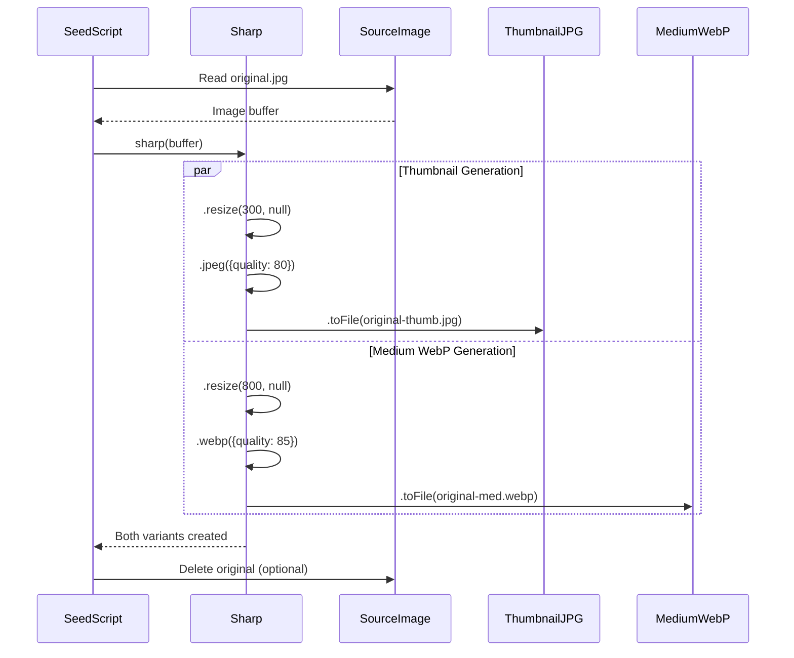
```mermaid
sequenceDiagram
    participant SeedScript
    participant Sharp
    participant SourceImage
    participant ThumbnailJPG
    participant MediumWebP
    
    SeedScript->>SourceImage: Read original.jpg
    SourceImage-->>SeedScript: Image buffer
    
    SeedScript->>Sharp: sharp(buffer)
    
    par Thumbnail Generation
        Sharp->>Sharp: .resize(300, null)
        Sharp->>Sharp: .jpeg({quality: 80})
        Sharp->>ThumbnailJPG: .toFile(original-thumb.jpg)
    and Medium WebP Generation
        Sharp->>Sharp: .resize(800, null)
        Sharp->>Sharp: .webp({quality: 85})
        Sharp->>MediumWebP: .toFile(original-med.webp)
    end
    
    Sharp-->>SeedScript: Both variants created
    SeedScript->>SourceImage: Delete original (optional)
```

**Key Points:**
- CSV is single source of truth for item data
- Sharp processing is optional (--with-sharp flag)
- Multiple image variants for performance
- TypeScript file auto-generated (don't edit manually)

---

## Accessibility Interaction Flows

### Screen Reader Navigation

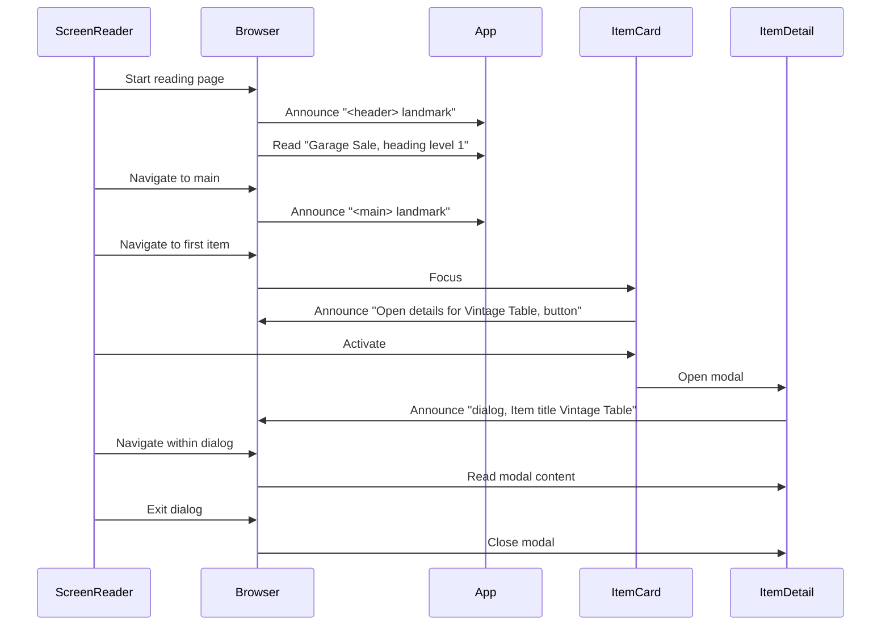
```mermaid
sequenceDiagram
    participant ScreenReader
    participant Browser
    participant App
    participant ItemCard
    participant ItemDetail
    
    ScreenReader->>Browser: Start reading page
    Browser->>App: Announce "<header> landmark"
    Browser->>App: Read "Garage Sale, heading level 1"
    
    ScreenReader->>Browser: Navigate to main
    Browser->>App: Announce "<main> landmark"
    
    ScreenReader->>Browser: Navigate to first item
    Browser->>ItemCard: Focus
    ItemCard->>Browser: Announce "Open details for Vintage Table, button"
    
    ScreenReader->>ItemCard: Activate
    ItemCard->>ItemDetail: Open modal
    ItemDetail->>Browser: Announce "dialog, Item title Vintage Table"
    
    ScreenReader->>Browser: Navigate within dialog
    Browser->>ItemDetail: Read modal content
    
    ScreenReader->>Browser: Exit dialog
    Browser->>ItemDetail: Close modal
```

### Keyboard-Only Navigation

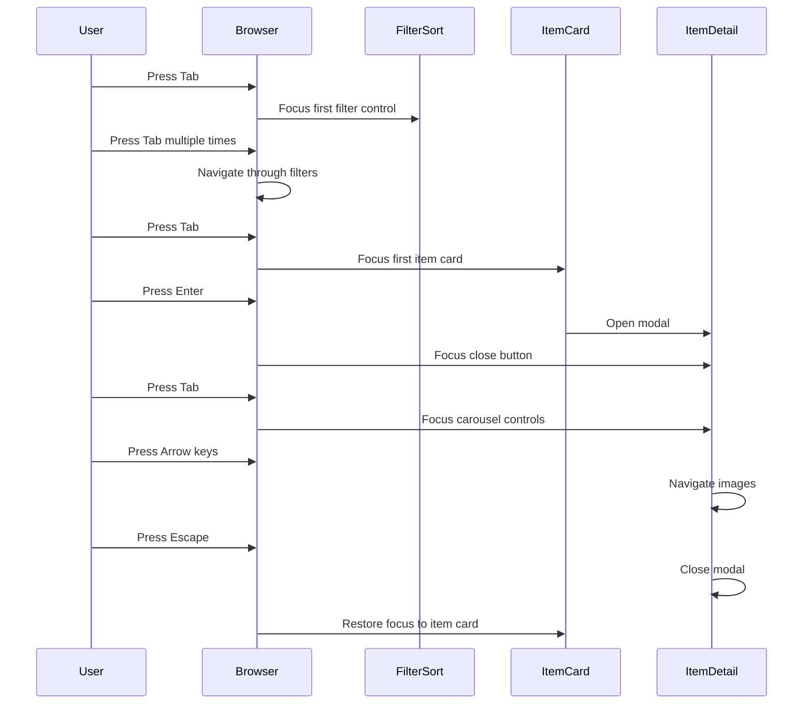
```mermaid
sequenceDiagram
    participant User
    participant Browser
    participant FilterSort
    participant ItemCard
    participant ItemDetail
    
    User->>Browser: Press Tab
    Browser->>FilterSort: Focus first filter control
    
    User->>Browser: Press Tab multiple times
    Browser->>Browser: Navigate through filters
    
    User->>Browser: Press Tab
    Browser->>ItemCard: Focus first item card
    
    User->>Browser: Press Enter
    ItemCard->>ItemDetail: Open modal
    Browser->>ItemDetail: Focus close button
    
    User->>Browser: Press Tab
    Browser->>ItemDetail: Focus carousel controls
    
    User->>Browser: Press Arrow keys
    ItemDetail->>ItemDetail: Navigate images
    
    User->>Browser: Press Escape
    ItemDetail->>ItemDetail: Close modal
    Browser->>ItemCard: Restore focus to item card
```

**Key Points:**
- All functionality accessible via keyboard
- Logical tab order maintained
- Focus properly managed in modal
- ARIA labels provide context for screen readers

---

## Error Handling Flows

### Missing Image Handling

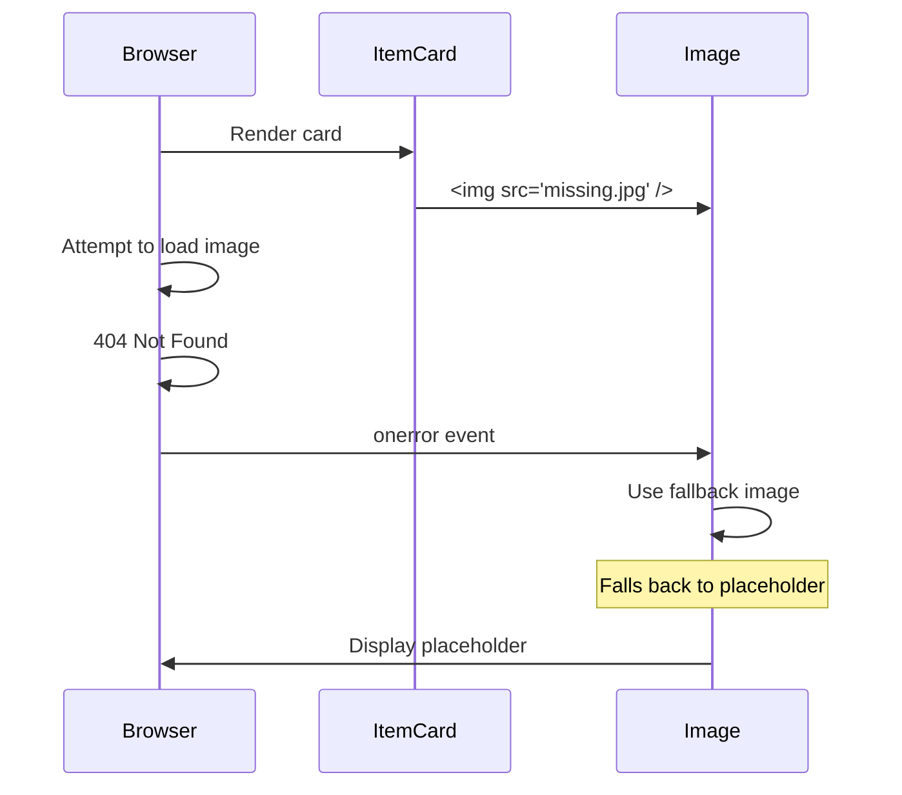
```mermaid
sequenceDiagram
    participant Browser
    participant ItemCard
    participant Image
    
    Browser->>ItemCard: Render card
    ItemCard->>Image: <img src="missing.jpg" />
    Browser->>Browser: Attempt to load image
    Browser->>Browser: 404 Not Found
    
    Browser->>Image: onerror event
    Image->>Image: Use fallback image
    Note over Image: Falls back to placeholder
    Image->>Browser: Display placeholder
```

### Filter No Results

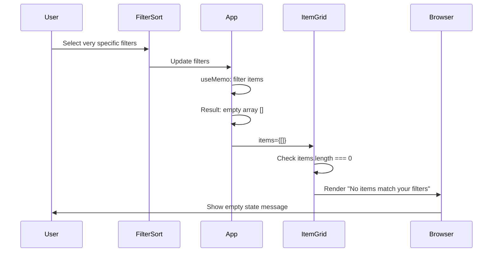
```mermaid
sequenceDiagram
    participant User
    participant FilterSort
    participant App
    participant ItemGrid
    
    User->>FilterSort: Select very specific filters
    FilterSort->>App: Update filters
    App->>App: useMemo: filter items
    App->>App: Result: empty array []
    App->>ItemGrid: items={[]}
    
    ItemGrid->>ItemGrid: Check items.length === 0
    ItemGrid->>Browser: Render "No items match your filters"
    Browser->>User: Show empty state message
```

**Key Points:**
- Graceful degradation for missing images
- Clear feedback for empty results
- No JavaScript errors break the UI

---

## Performance Optimization Flows

### useMemo Optimization

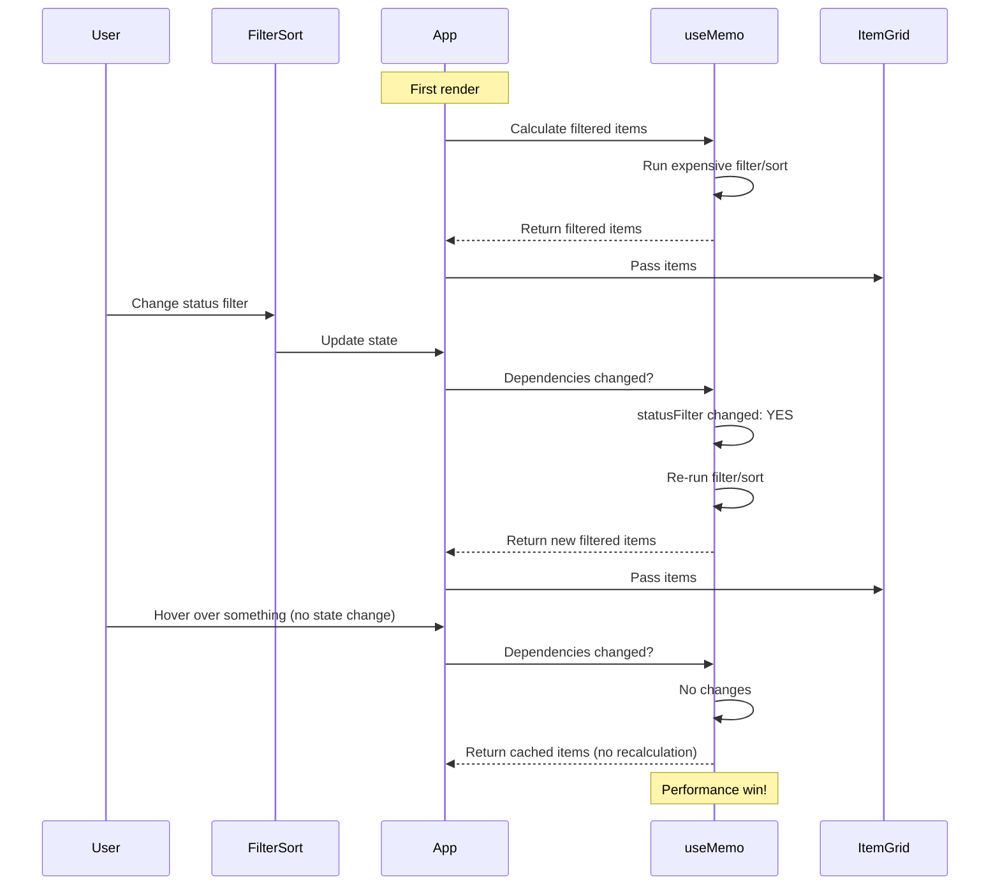
```mermaid
sequenceDiagram
    participant User
    participant FilterSort
    participant App
    participant useMemo
    participant ItemGrid
    
    Note over App: First render
    App->>useMemo: Calculate filtered items
    useMemo->>useMemo: Run expensive filter/sort
    useMemo-->>App: Return filtered items
    App->>ItemGrid: Pass items
    
    User->>FilterSort: Change status filter
    FilterSort->>App: Update state
    App->>useMemo: Dependencies changed?
    useMemo->>useMemo: statusFilter changed: YES
    useMemo->>useMemo: Re-run filter/sort
    useMemo-->>App: Return new filtered items
    App->>ItemGrid: Pass items
    
    User->>App: Hover over something (no state change)
    App->>useMemo: Dependencies changed?
    useMemo->>useMemo: No changes
    useMemo-->>App: Return cached items (no recalculation)
    Note over useMemo: Performance win!
```

**Key Points:**
- Expensive operations memoized
- Only recalculate when dependencies change
- Prevents unnecessary re-renders
- Keeps UI responsive

---

**Last Updated**: November 2025
